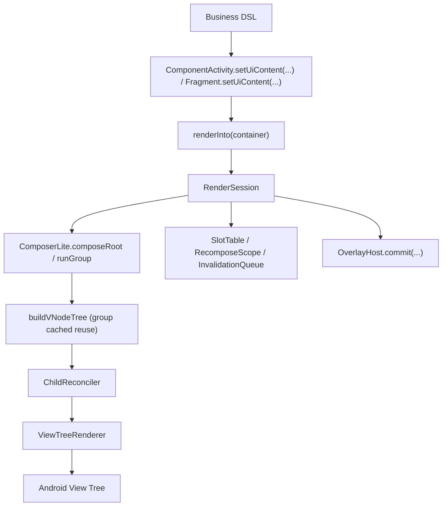

# ViewCompose Architecture

## 1. 文档定位

本文档是 `ViewCompose` 的**当前架构规范版**，用于定义：

1. 模块职责边界
2. 核心调用链
3. 新增代码的落点规则
4. 变更时必须遵守的约束

如果实现要偏离本文档，必须先更新文档，再改代码。

历史长版快照见：

- [ARCHITECTURE_FULL_2026-03-06.md](/Users/gzq/AndroidStudioProjects/UIFramework/docs/archive/ARCHITECTURE_FULL_2026-03-06.md)

## 2. 当前基线（2026-07）

- 技术基线：Kotlin + Android View System
- SDK：`minSdk 24`、`compileSdk 36`
- 当前模块：`:viewcompose-runtime`、`:viewcompose-text-core`、`:viewcompose-ui-contract`、`:viewcompose-navigation-core`、`:viewcompose-navigation`（特性分支孵化中）、`:viewcompose-animation-core`、`:viewcompose-animation`、`:viewcompose-gesture-core`、`:viewcompose-gesture`、`:viewcompose-graphics-core`、`:viewcompose-graphics`、`:viewcompose-shadow-android`、`:viewcompose-widget-core`、`:viewcompose-widget-constraintlayout`、`:viewcompose-renderer`、`:viewcompose-host-android`、`:viewcompose-overlay-android`、`:viewcompose-image-coil`、`:viewcompose-lifecycle`、`:viewcompose-viewmodel`、`:viewcompose-preview-core`、`:viewcompose-preview-runner`、`:viewcompose-preview`、`:viewcompose-benchmark`、`:app`

### 2.1 模块职责

| 模块 | 职责 | 约束 |
| --- | --- | --- |
| `viewcompose-runtime` | 状态与读依赖观察（`state/observation`） | 纯 Kotlin/JVM 模块；主源码禁止 `android.*` / `androidx.*`，构建不引入 AndroidX 依赖 |
| `viewcompose-text-core` | 完整纯文本编辑状态（text/selection/composition）、EditingBuffer、输入变换、撤销/重做 | 纯 Kotlin/JVM；禁止 Android 类型；偏移统一使用 UTF-16 以匹配平台编辑协议 |
| `viewcompose-ui-contract` | 纯 Kotlin UI 契约层（`Modifier`、`VNode/NodeSpec`、layout 枚举、collection/state 协议） | 主源码禁止 `android.*` / `androidx.*` |
| `viewcompose-navigation-core` | 系统导航内核（route/back stack/two-phase transaction/page lifecycle planning） | 纯 Kotlin/JVM；禁止 Android/AndroidX 类型；页面 Session 与平台 back 适配不得进入此模块 |
| `viewcompose-navigation` | Android 系统导航集成（destination owner/page session/NavHost/back adapter） | 依赖 navigation-core 与 host-android；稳定前不向 app 默认入口注入，不允许 host-android 反向依赖 |
| `viewcompose-animation-core` | 动画内核（`AnimationSpec/Easing/Converter/Engine/TransitionCore`） | 纯 Kotlin/JVM；禁止引入 Android 依赖 |
| `viewcompose-animation` | 动画 DSL 集成层（`animate*AsState/Animatable/Transition/AnimatedVisibility/Content`） | 调用层 API；运行时驱动统一使用 `MonotonicFrameClock` + coroutine；不直接依赖 Android View 动画实现 |
| `viewcompose-gesture-core` | 手势策略内核（axis lock、transform slop、swipe settle） | 纯 Kotlin/JVM；禁止引入 Android 依赖；renderer 只做事件适配并调用该内核 |
| `viewcompose-gesture` | 平台无关手势 DSL 入口层（`pointerInput`、`combinedClickable`、`draggable/anchoredDraggable/transformable`） | 仅定义手势 modifier 与状态入口；不承载策略判定实现 |
| `viewcompose-graphics-core` | 图形绘制内核（geometry/path/brush/draw command/draw cache） | 纯 Kotlin/JVM；禁止引入 Android 依赖；仅定义平台无关图形模型 |
| `viewcompose-graphics` | 图形 DSL 集成层（`Canvas`、`drawBehind`、`drawWithContent`、`drawWithCache`） | 仅定义业务 API 与契约映射；不直接依赖 Android Canvas 实现 |
| `viewcompose-shadow-android` | 可选高级阴影后端、缓存与 Android 绘制实现 | 依赖 renderer 的最小 Decoration SPI；renderer/host 不依赖该模块；通过 ServiceLoader 或显式安装接入 |
| `viewcompose-widget-core` | DSL、Theme/Defaults、Local 与 overlay 声明契约 | 不依赖 `viewcompose-renderer`；不放 Android 宿主入口 API |
| `viewcompose-widget-constraintlayout` | ConstraintLayout 组件 DSL（`ConstraintLayout/createRef(s)/constrainAs/constrain/constraintSet`） | 仅承载约束布局 DSL 与 scope；平台渲染实现仍在 `viewcompose-renderer` |
| `viewcompose-renderer` | Android View 渲染实现（reconcile、binder、patch、container） | 只消费 `ui-contract`，不承载业务 DSL |
| `viewcompose-host-android` | Android 宿主运行时与入口（`setUiContent/renderInto/RenderSession`、`AndroidView/nativeView`、宿主 Local 注入） | 只做平台执行与注入，不承载业务 DSL |
| `viewcompose-overlay-android` | Android overlay host/presenter（Dialog/Popup/ModalBottomSheet/Snackbar/Toast） | 只做平台实现，不依赖 renderer 资源 |
| `viewcompose-image-coil` | 远程图片加载桥接（`RemoteImageLoader` Android 实现） | 通过平台无关 target 契约接入，不回流核心渲染逻辑 |
| `viewcompose-lifecycle` | 生命周期感知的状态收集 API（`collectAsStateWithLifecycle`）与生命周期 Local 对外入口 | 不承载 Android 视图实现；不新增宿主注入逻辑 |
| `viewcompose-viewmodel` | ViewModel/SavedStateHandle 协作 API（`viewModel`、`savedStateHandle`）与 ViewModel Local 对外入口 | 不承载 Android 视图实现；不新增宿主注入逻辑 |
| `viewcompose-preview-core` | Preview 注解、确定性配置和跨进程请求/结果协议 | 纯 Kotlin/JVM；禁止 Android、Compose 与 IDE SDK 依赖 |
| `viewcompose-preview-runner` | 隔离进程内的原生 View 静态渲染、图片导出和结构化诊断 | 允许 Android/Layoutlib；禁止 Compose 与 IDE SDK 依赖 |
| `viewcompose-preview` | 开发预览与截图回归（Compose Preview bridge、PreviewCatalog、Paparazzi） | 仅开发态能力；不参与 app 运行时入口；禁止依赖 `:app` |
| `viewcompose-benchmark` | 宏基准入口与性能回归数据采集 | 不承载业务 demo 与框架语义逻辑 |
| `app` | demo、manual verification、ui tests 入口 | 不承载框架核心实现 |

### 2.2 当前架构判断

当前架构是可维护的 View-based 声明式 v1：

1. 主树更新模型：`SlotTable Lite` 节点组脏区重组 + 根树引用复用
2. 列表/分页等复用容器：独立 session 刷新路径
3. overlay：声明契约与平台实现已分层
4. 节点语义已完成 `NodeSpec-only` 收口（无 `Props` 双轨）
5. 生命周期与 ViewModel 协作 API 已从 `widget-core` 拆分到独立模块，宿主自动注入能力保持不变
6. 动画与手势已形成“内核 + DSL + Android interop 扩展”分层模型（animation-core + animation、gesture-core + gesture、host interop）
7. graphics 已形成“内核 + DSL + renderer + host interop”分层模型（graphics-core + graphics + renderer draw pipeline + host-android AndroidGraphicsInterop）
8. ConstraintLayout 已按“widget DSL 模块 + renderer 平台映射”分层落地，支持 anchors/dimension/bias/baseline/baselineToTop/baselineToBottom/circle/guideline/barrier/chain(+weights)/Flow/Group/Layer/Placeholder/decoupled constraintSet，以及 match-constraint 进阶参数（min/max/percent/constrained）
9. Theme token 已进入“消费闭环”阶段：新增 token 必须进入 defaults/composite 默认值，或明确登记为 reserved semantic palette
10. 文本输入已硬切到 `TextFieldState` 单一状态主权：纯 Kotlin 编辑内核负责值、选区、组合区与历史；renderer 的 `ViewComposeEditText` 只负责 Android `Editable/InputConnection` 适配
11. 系统导航在独立特性分支孵化：先稳定纯 Kotlin 返回栈事务与页面生命周期内核，再接入 Android 页面 Session；稳定前不改变现有 Activity/Fragment 宿主入口

### 2.3 `app` 目录落位基线

`app` 模块采用“入口与演示分层”：

1. `app/src/main/java/com/viewcompose/activity/entry`
   - 根入口 Activity（如 `MainActivity`、渲染宿主入口）
2. `app/src/main/java/com/viewcompose/activity/demo/pages/<domain>`
   - demo 页面 Activity 路由入口，按页面域分层（`core/interaction/advanced/quality`）
3. `app/src/main/java/com/viewcompose/activity/demo/sandbox`
   - 非核心页面实验入口（动画/手势/图形等）
4. `app/src/main/java/com/viewcompose/demo/core`
   - demo 全局骨架与共享能力（catalog、theme session、test tags、section helpers）
5. `app/src/main/java/com/viewcompose/demo/pages/<feature>`
   - 按功能页归档的 demo 实现（foundations/layouts/input/feedback/...）
6. `app/src/androidTest/java/com/viewcompose`
   - demo/UI 回归测试

### 2.4 `viewcompose-renderer` 目录落位基线

renderer 侧避免“单目录平铺”，按职责拆到二级目录：

0. `NodeType/VNode/NodeSpec` 及其子类型只允许定义在 `viewcompose-ui-contract`；renderer 禁止新增 `com.viewcompose.renderer.node` 镜像契约。
1. `viewcompose-renderer/src/main/java/.../view/container/{core,layout,collection,navigation,input}`
   - Android View 容器映射层，按控件族群分类
2. `viewcompose-renderer/src/main/java/.../view/tree/binder/core`
   - 绑定流程核心（factory/differ/plan/registry/modifier）
   - `NodeBinderDescriptors` 是 bind/patch/diff 元数据单源注册表（禁止并行映射）
   - descriptor 源文件固定收敛在 `core/descriptor/`，禁止回流平铺到 `core/` 根目录
   - `ViewModifierApplier` 仅作 facade，具体职责拆到 `core/modifier` 子模块
   - 容器策略（reuse/motion/focus follow）由 widget DSL 写入 `NodeSpec`，binder 直接读 spec 应用，不再走 modifier 策略提取
3. `viewcompose-renderer/src/main/java/.../view/tree/binder/widget`
   - 分控件 binder 实现（content/input/media/feedback/collection 等）
   - TextField 固定通过 `ViewComposeEditText + AndroidTextFieldController` 同步完整编辑快照；禁止在普通重组补丁中无条件 `setText()` 或把光标移动到末尾
4. `viewcompose-renderer/src/main/java/.../view/lazy/{adapter,focus,layout,reuse,session,state}`
   - 延迟容器子系统按能力拆分（适配器、焦点跟随、间距布局、复用策略、session、状态）
   - `LazyListState` 由 RecyclerView scroll/layout/adapter observer 推送不可变布局快照；绑定同一 RecyclerView 时禁止重置 anchor
   - item key/contentType/span/sticky kind 属于 `ui-contract`，Android 侧分别映射 stable ID、view type、SpanSizeLookup 与 pinned header decoration

## 3. 核心调用链

## 4. 强约束边界

### 4.1 平台实现边界

1. Android `Dialog/PopupWindow/Toast/Snackbar` 宿主实现只放 `viewcompose-overlay-android`。
2. `viewcompose-widget-core` 只保留平台无关声明契约与 runtime 组合能力。
3. demo 专用逻辑不回流到框架模块。

### 4.2 `Modifier / NodeSpec / Theme` 边界

1. `Modifier`：通用修饰与 scoped parent-data。
2. 组件语义参数：走组件 DSL 参数 + `NodeSpec`。
3. 主题默认值：走 `Theme -> Defaults`，不把主题直接做成通用 modifier。
4. `AndroidThemeBridge` 固定走“snapshot reader + token mapper”两层实现：reader 只读 Android / AppCompat / Material 平台字段，mapper 只做语义映射与 fallback。
5. `AndroidThemeBridge` 当前允许 best-effort 映射 `surfaceTint` 与统一圆角 `shapeAppearance*Component`；不允许为了表面覆盖率在 bridge 中猜测非统一四角 shape 或控件三档尺寸。
6. `controls` 继续保持 framework-owned defaults，除非 Android 原主题系统存在稳定且统一的来源；禁止把零散 widget style 强行提升为全局 token 真相源。
7. `viewcompose-ui-contract` 的 `Modifier` 文件只承载“全局稳定语义”的元素声明与 builder；仅特定容器生效的策略必须进入容器 DSL 参数与 `NodeSpec`。
8. 禁止新增 `Props/TypedPropKeys/PropKeys/node.props` 动态语义路径。
9. 约束 parent-data（`layoutId/constrainAs/constrain`）仅允许用于 `ConstraintLayout` 子节点；错误宿主必须输出 validator 警告。
10. 复合组件内部文本样式必须通过 `NodeSpec` 全量传递（`fontSize/fontWeight/fontFamily/letterSpacing/lineHeight/includeFontPadding`），禁止重新退回“只传 `textSizeSp`”。

对应规范：

- [MODIFIER.md](/Users/gzq/AndroidStudioProjects/UIFramework/MODIFIER.md)
- [NODE_PROPS.md](/Users/gzq/AndroidStudioProjects/UIFramework/NODE_PROPS.md)
- [THEMING.md](/Users/gzq/AndroidStudioProjects/UIFramework/THEMING.md)

### 4.3 宿主接入边界

1. `com.viewcompose.host.android.ComponentActivity.setUiContent(...)` 不暴露内部 `RenderSession` 给页面调用方，并由宿主自动管理 `dispose`。
2. `com.viewcompose.host.android.Fragment.setUiContent(...)` 是官方入口：不暴露内部 `RenderSession`，并在 `viewLifecycleOwner` 销毁时自动 `dispose`。
3. `setUiContent` 的默认 `overlayHostFactory` 走 `OverlayHostDefaults.androidOrNoOp(...)`：优先通过 `OverlayHostFactoryProvider`（`ServiceLoader`）发现 Android 实现；缺失时回退 no-op 并输出提示。
4. `overlay-android` 必须通过 `META-INF/services` 注册 `OverlayHostFactoryProvider`，禁止回退字符串反射装配（`Class.forName`）。
5. host 对外回调 `onRenderStats/onRenderResult` 只能暴露 core 自有诊断类型（`com.viewcompose.widget.core.RenderStats/RenderTreeResult`），renderer 诊断类型仅允许出现在 host 内部适配层。
6. system bars insets 走组件侧 `Modifier.systemBarsInsetsPadding(...)`，不绑死 Activity 全局参数。
7. `viewcompose-host-android` 必须通过 `installRenderSessionPlatform(...)` 一次性原子注册渲染引擎、帧调度 runtime 与组合协程上下文；`RenderSession` 创建时固定使用同一平台快照，缺失或重复安装立即失败，禁止 no-op/immediate/empty-context 分段降级。

### 4.4 延迟 session 容器边界

只要容器满足“延迟创建 + holder/session 复用”，就必须视为一级架构对象，必须具备：

1. 结构稳定时的可见内容刷新路径
2. 空 diff 刷新保障
3. recycle/dispose 与生命周期一致性
4. framework 托管的 `RecyclerView/ViewPager2` 容器默认保持“本地池 + 系统动画器”；可通过容器参数 `reusePolicy/motionPolicy` 对单个容器启用共享池与动画策略，并通过垂直容器参数 `focusFollowKeyboard` 控制键盘跟随。

专项清单：

- [SESSION_CONTAINER_CHECKLIST.md](/Users/gzq/AndroidStudioProjects/UIFramework/SESSION_CONTAINER_CHECKLIST.md)

### 4.5 Environment 边界

1. 宿主入口（`com.viewcompose.host.android.setUiContent(...)`）默认自动注入 `UiEnvironment(androidContext = root.context)`。
2. 业务层允许在局部子树使用 `UiEnvironment(values = ...)` 做覆盖；默认注入不阻断局部覆写。
3. `viewcompose-renderer` 不依赖 `viewcompose-widget-core/context/Environment`，只消费 renderer 已解析的 `NodeSpec` 与平台参数。
4. `viewcompose-renderer` 中的 dp/sp 尺寸换算统一走内部工具（`viewcompose-renderer/view/DimensionUtils.kt`），容器类禁止私有 `density/dpToPx` 重复实现。
5. Android 平台环境提取入口固定为 `AndroidEnvironmentBridge`，新增 Android 环境字段时必须先扩展该桥接，再进入 `UiEnvironmentValues`。

### 4.6 Local 扩展边界

1. 业务侧自定义 token 必须通过统一 Local API：`uiLocalOf`、`UiLocals.current`、`ProvideLocal`、`ProvideLocals`。
2. `viewcompose-widget-core` 内置 Local 也统一走上述 API，不再新增专用 `ProvideXxx` 调用范式。
3. `viewcompose-renderer` 不新增 Local 语义入口；只消费 reconcile 后的 `NodeSpec`。
4. Local 的 snapshot/restore 必须与延迟容器、overlay 场景一致传播，不允许能力回退。
5. 生命周期与 ViewModel 相关 Local 的对外包名固定为 `com.viewcompose.lifecycle` 与 `com.viewcompose.viewmodel`；默认注入由 `viewcompose-host-android` 的 `AndroidHostBridge` 完成。

### 4.7 SlotTable Lite 重组边界

1. `ComposerLite` 是唯一组合内核，`RenderSession` 仅负责“首帧 compose + 后续增量 recompose”的调度，不再走 session 级全树读依赖观察；失效重绘调度固定走 `Choreographer` 帧对齐路径。
2. 组边界由 `UiTreeBuilder.emit(...)` 建立；未脏组直接复用上次 `VNode` 引用，dirty 组才重建。
3. 组级失效来源固定为两类：状态读依赖失效、`emit` 输入（`spec/modifier`）变化；两者都进入 `InvalidationQueue` 去重合并。
4. 结构漂移（同层 group key/顺序不一致）必须回退到最近稳定祖先子树重组，并只打印一次告警，禁止 silent corruption。
5. `LocalContext` 必须按组 snapshot/restore，保证局部重组下 Local 读取一致。
6. `remember`、`key`、`DisposableEffect`、`SideEffect`、`LaunchedEffect`、`rememberCoroutineScope` 等组合 API 只允许在活动的 `ComposerLite` 组合中调用；禁止维护备用 slot/effect store 或在组合外静默降级。

### 4.8 文本编辑边界

1. `viewcompose-text-core` 是文本、方向选区、IME 组合区、编辑事务和撤销历史的唯一平台无关真相源。
2. `TextField/TextArea/SearchBar` 公开 API 只接受稳定的 `TextFieldState`；禁止重新增加 `String + onValueChange` 双状态入口。
3. Android renderer 必须保留原生 `AppCompatEditText` 的输入法、无障碍、硬件键盘和系统选择能力，不实现自有文本布局或完整 `InputConnection`。
4. 原生输入在 `InputConnection`/batch edit 边界内合并后同步到状态；状态回写必须使用最小 `Editable.replace()` 并恢复 selection/composition。
5. `InputTransformation` 只处理用户输入，程序调用 `TextFieldState.edit` 不经过输入过滤。
6. 保存恢复只持久化 text 与 selection；IME composition 和 undo/redo history 属于当前编辑会话，不跨进程恢复。
7. 富文本 span、inline attachment 与统一 receive-content 属于独立文档模型能力，不允许通过把 Android `Spannable` 放入 core 契约来实现。

### 4.9 State Snapshot 边界

1. `MutableState` 必须通过 snapshot 事务写入，不允许绕过 `SnapshotRuntime` 直接改值。
2. `mutableStateOf` 的去抖/冲突语义由 `SnapshotMutationPolicy` 定义；默认 `structuralEqualityPolicy`。
3. 并发 `MutableSnapshot.apply()` 冲突处理固定为：先判等、再 merge、merge 失败即失败返回。
4. `ComposerLite` 每轮 compose 必须运行在一致性读快照中，保证同一轮读取不漂移。
5. `DerivedState` 缓存失效必须感知 snapshot 读版本，禁止仅靠全局 dirty 布尔。
6. `rememberUpdatedState` 只保证“重组后可见”，不保证“同一组合阶段 effect 立即读取到最新值”。
7. `ComposerLite.prepareRoot()` 只生成候选组合；slot、观察订阅、`RememberObserver` 与 Effect 生命周期必须在 renderer 成功后提交，失败时统一 abort。
8. `DisposableEffect`、`SideEffect` 与 `RememberObserver.onRemembered` 只允许在提交阶段执行；失败候选中的 remembered value 必须收到 `onAbandoned`。
9. `RenderSession` 是组合协程树的唯一根 owner：根使用 `SupervisorJob` 隔离子任务，Session 销毁必须取消全部后代。
10. `LaunchedEffect` 的启动/Key 重启/遗忘取消必须由 `RememberObserver` 提交生命周期驱动，失败组合不得启动任务。
11. `produceState` 固定为 suspend producer，并通过 `awaitDispose` 清理；`collectAsState*` 与动画不得创建独立根 Job。
12. 传给 `rememberCoroutineScope`、`collectAsState*` 与动画的附加 `CoroutineContext` 不得包含 `Job`，防止脱离组合父任务。
13. 组合阶段若先写 snapshot-backed mirror state 再立刻读回，该读值可能仍是旧快照；控制流判定必须基于实时内核值，不得依赖同帧 mirror 回读。
14. 组合事务保证 slot/观察/Effect/VNode 提交一致性；组合体内主动写入的全局 snapshot state 仍遵循 snapshot 自身事务，不承诺与 Android View patch 跨系统原子回滚。
15. 组合事务使用 touched-scope journal：只有本轮实际执行或输入变化的 Scope 才复制回滚状态，禁止恢复为每帧全 SlotTree checkpoint。
16. 相同帧到达同一 Scope 的重复失效必须合并；组合进行中的失效仍须递增版本，保证本轮结束后保留下一次重组。
17. 脏 Scope 若生成 type/key/spec/modifier/children 引用均等价的 VNode，必须沿用旧 VNode 引用，为 renderer 提供 O(1) `SkipSubtree`。
18. 无编译器自动 restart group；跨多个兄弟 VNode 的业务组件应按需使用无原生节点的 `RecomposeBoundary`，普通捕获值显式声明为 inputs。

### 4.10 Render 调度边界

1. `RenderSession.render()` 保持立即执行语义（首帧与显式调用同步渲染）。
2. 状态失效触发的重绘必须通过 `FrameAlignedRenderDispatcher` 合帧调度，禁止回退到 `container.post`。
3. 同一帧内多次 invalidation 只能触发一次 `RenderSession` 渲染提交。
4. `dispose()` 必须取消未执行帧回调，禁止 session 销毁后延迟渲染。
5. lazy item session 与 overlay surface session 继续复用 `RenderSession.render()` 的立即语义，避免首显空白。
6. renderer 的递归 patch 必须共享一次 apply transaction；删除资源只能在整棵树成功后释放。
7. patch 失败必须尽力恢复旧 `VNode`、mounted children、布局参数与 View 顺序，并释放本轮新建节点。
8. `AndroidView.update/onReset/nativeView` 仅允许可重放的 View 内配置；不可重放的外部动作必须放入事务成功后才发布的 `onCommit`。
9. renderer transaction 使用 mutation journal，只记录实际绑定、移动、插入或删除的 MountedNode/ViewGroup；稳定子树不得进入回滚快照。
10. `AnimatedSizeNodeWrapper` 必须保留未变化 VNode/List 的引用，且整帧只转换一次；禁止无动画节点的递归 copy。
11. `NodeBindingDiffer` 必须先于 Modifier/LayoutParams 解析执行；`SkipSubtree` 不得解析或重复 preflight。
12. 结构深度统计与逐 NodeType 绑定统计只在 debug/诊断回调启用时收集。
13. 所有可恢复失败必须通过 `RenderFailure(phase/recovery/frameId/operation/nodeKey)` 上报；日志不是可观测性 API。

### 4.11 Renderer 绑定复杂度边界

1. `NodeViewBinderRegistry` 与 `NodeBindingDiffer` 的 bind/patch/diff 映射必须从 `NodeBinderDescriptors` 单源派生，禁止新增并行手工 map。
2. 新增 `NodeType` 或新增 `NodeViewPatch` 时，只允许修改 descriptor 源；不得同时改 registry/differ 的独立映射分支。
3. descriptor 源文件必须落在 `view/tree/binder/core/descriptor/`，`core/` 根目录禁止新增 `NodeBinder*.kt` 平铺文件。
4. `ViewModifierApplier` 仅负责编排，不承载具体细节实现；样式/交互/insets/容器策略必须分别落在 `core/modifier` 子职责对象。
5. 任何绕过 descriptor 的快速修复都视为架构违规，必须在同一迭代回补为单源注册。

### 4.12 模块单包根边界

1. 每个模块只允许一个包根前缀，且必须与模块职责对应（允许该前缀下的子包分层）。
2. 约束范围覆盖 `src/main`、`src/test`、`src/androidTest`，测试源码不允许例外包根。
3. Android 模块 `namespace` 必须与该模块包根一致（`viewcompose-ui-contract` 作为 Kotlin/JVM 模块例外）。
4. lifecycle/viewmodel 的 Local 对外 API 包名固定为 `com.viewcompose.lifecycle` 与 `com.viewcompose.viewmodel`，并且源码归属必须落在对应模块，不得回流 `widget-core`。

### 4.13 开发预览边界

1. 平台无关 Preview 注解、确定性配置和进程协议集中在 `:viewcompose-preview-core`，禁止 Android、Compose 与 IDE SDK 依赖。
2. 原生静态挂载、measure/layout/draw 与诊断导出集中在 `:viewcompose-preview-runner`；禁止 Compose 和 IDE SDK 依赖。
3. Compose Preview 适配器、`PreviewCatalog` 与 Paparazzi 资产集中在 `:viewcompose-preview`，不允许回流 `app` 或核心运行时模块。
4. Android Studio Preview 与 Paparazzi 必须共享 `PreviewCatalog` 单源，禁止双份示例维护。
5. preview worker 与 IDE 插件必须通过带版本的结构化协议通信，业务渲染代码禁止运行在 IDE 进程内。
6. overlay 在 preview 场景仅允许静态内容模拟；真实窗口行为继续由 instrumentation 覆盖。
7. 新增组件（或关键复合组件）必须同轮补 `PreviewSpec` 与 Paparazzi 快照基线。

### 4.14 动画与手势边界

1. 动画分层固定为 `viewcompose-animation-core` + `viewcompose-animation`；手势分层固定为 `viewcompose-gesture-core` + `viewcompose-gesture`。
2. `graphicsLayer` 是主链动画承载能力；与 `alpha/offset/elevation/zIndex` 冲突时，以 `graphicsLayer` 同语义字段优先。
3. Android 高阶动画（`TransitionManager/MotionLayout/Animator`）只能通过 `viewcompose-host-android` 的 interop 入口接入，禁止回流到平台无关主链。
4. renderer 手势消费规则固定为“手势先消费，未消费再回落 clickable”，并维持方向锁 + slop + priority 的冲突策略。
5. 列表/分页动画默认 opt-in（`motionPolicy`），并与 `reusePolicy` 兼容，不改变未启用容器行为。
6. `AnimatedVisibility` 语义固定为 Compose 对齐：默认 `fadeIn+expandIn` / `shrinkOut+fadeOut`，并通过 `NodeType.AnimatedVisibilityHost` 参与父布局尺寸动画；exit 全部动画完成后才移除 subtree。
7. 手势仲裁顺序固定为 `pointerInput -> transform/drag/swipe -> combinedClickable`；当 `pointerInput` 返回 `Consumed` 时，必须强短路后续链路。
8. transform 激活必须经过 slop 门槛：`panMotion`、`abs(1 - zoomChange) * centroidSize`、`abs(rotationRadians) * centroidSize` 任一超过 `touchSlop` 才进入 active 状态。
9. anchored settle 语义固定为“速度优先 + 距离次之 + 最近 anchor 兜底”：先比较 `minimumFlingVelocity`，再比较 `max(touchSlop * 2, segmentSpan * 0.35)`，否则回最近锚点。
10. transform active 后每帧只派发一次合并 delta（zoom/pan/rotation），并在 active 时再请求 `requestDisallowInterceptTouchEvent(true)`，避免提前抢占父容器。
11. `Modifier.animateContentSize(...)` 通过 renderer 侧 `AnimatedSizeHost` 结构包装落地，执行真实测量尺寸插值并参与父布局重排（非 `graphicsLayer` 缩放假象）；`AnimationSpec` 的 easing/spring/keyframes/repeat/reverse 语义必须在执行层保持一致。
12. `Animatable` 默认通过 `rememberAnimatable(...)` 绑定 frame clock，`animateTo(...)` 不再要求调用侧显式传 `frameClock`；非组合场景可通过构造参数显式绑定。
13. `AnimatedSizeHost` 收起路径必须避免“子节点先跳到末端尺寸”；子节点布局需跟随 host 当前动画尺寸，保证展开/收起两方向的视觉连续性。
14. 手势策略新增或修改（axis lock/slop/swipe settle）必须下沉到 `viewcompose-gesture-core`；renderer 禁止新增并行策略分支。
15. `combinedClickable` 只有在 `enabled=true` 且至少提供一个回调（click/double/long）时才参与仲裁；无回调场景必须视为 no-op 且不消费触摸流。

### 4.15 Graphics 边界

1. graphics 分层固定为 `viewcompose-graphics-core`（平台无关图形内核）+ `viewcompose-graphics`（业务 DSL）+ renderer（Android Canvas 执行）+ `viewcompose-host-android` interop（Android 特有高阶能力）。
2. `viewcompose-graphics-core` 主源码禁止 `android.*` / `androidx.*` import；纯度由 `verifyGraphicsCorePurity` 硬门禁。
3. draw modifier 绘制顺序固定：`drawBehind` 在内容前，`drawWithContent` 显式控制内容绘制，多 draw modifier 按 modifier 链顺序稳定执行。
4. `drawWithCache` 语义固定为“依赖变化才重建缓存命令”；禁止每帧重建缓存对象掩盖性能问题。
5. Android 专属高阶图形能力（`RenderEffect`、`RuntimeShader`、`Drawable/Canvas` bridge）只能经 `host-android` 的 `AndroidGraphicsInterop` 暴露，禁止回流平台无关主链。
6. `DrawRoundRect` 必须遵守四角半径语义：四角一致时走 `drawRoundRect` 快路径，非一致时走 `Path.addRoundRect`，禁止退回“只读 topLeft”实现。
7. `DrawImage` 的 `Drawable` 分支必须应用 `DrawPaint` 组合语义（alpha/blend/colorFilter/imageFilter），并在绘制后恢复原始 `bounds`。
8. `ImageFilterModel.Chain` 必须在执行层可生效；当前 `Blur + Chain` 路径采用递归合并半径（高斯方差累加）后下发到平台滤镜，禁止直接忽略 `Chain`。

### 4.15.1 高级阴影装饰边界

1. 平台无关契约固定在 `viewcompose-ui-contract`：`UiShadow` 与 `dropShadow(s)/innerShadow(s)` 只保存有序、不可变的逻辑单位规格。
2. renderer 只拥有 `AndroidViewDecorationBackend` 最小协议、通用宿主、父级活跃装饰索引和独立的 `zIndex` 排序；`viewcompose-renderer` 与 `viewcompose-host-android` 禁止依赖具体阴影模块。
3. Android 栅格化、缓存、后端选择和诊断固定在可选 `viewcompose-shadow-android`；它通过 `META-INF/services` 注册后端，也允许应用启动时显式调用 `ShadowDecorationLayer.install()`。
4. 后端缺失时 `dropShadow(s)/innerShadow(s)` 必须稳定降级为 no-op，核心渲染、Lazy、Pager、Tab、预览和宿主仍可独立编译运行。
5. `setUiContent` 创建的必要根容器本身就是通用 Decoration Host，不得再嵌套额外 FrameLayout；任意 `renderInto` 容器只在顶层节点确实需要装饰或 `zIndex` 时按需增加宿主。
6. 没有活跃装饰 child 时，容器 `drawChild` 只能执行一次父级布尔快速判断后直达原生绘制，不得逐 child 查询阴影 tag 或调用具体后端；没有非零 `zIndex` 时必须关闭自定义 child drawing order，交回 Android 原生顺序。
7. 框架容器在 child 内容前绘制外阴影、在 child 完整内容与 foreground 后绘制内阴影；不得为每层阴影创建额外业务 View。
8. 高级阴影不参与 measure/layout、hit test、焦点或无障碍；`zIndex`、Material `elevation` 与精确阴影保持三套独立语义。
9. 多层阴影严格保留声明顺序；外阴影可超出 child bounds，但仍受最近 viewport/显式 clip chain 约束；内阴影必须裁切在 shape 内。
10. 静态栅格缓存 key 必须覆盖尺寸、density、layout direction、shape 与完整规格；仅平移、缩放、旋转或 alpha 变化不得重建栅格。
11. `ShadowRenderPolicy.Auto` 的当前默认后端是 `ExactBitmap`。`RenderNodeDisplayList` 只作为 API 29+ 显式实验策略；没有同设备发布态数据证明稳定收益前不得切换默认值。
12. Lazy 回收、节点移除、事务回滚与 RenderSession dispose 必须同步移除阴影规格；父级索引不得通过全局强引用持有 View，进程级缓存只能保存不可变栅格。
13. 公开使用规则、限制与验证入口见 [SHADOWS.md](/Users/gzq/AndroidStudioProjects/UIFramework/SHADOWS.md)。

### 4.16 Semantics 与无障碍边界

1. 无障碍声明统一使用 `Modifier.semantics { ... }` 与 `SemanticsConfiguration`；`contentDescription` 只是该结构化契约的便捷入口，禁止新增平行单字段 Modifier。
2. 平台无关契约必须覆盖描述、状态、role、heading、live region、选中/勾选/启用、错误、进度、pane title、点击标签、合并后代与隐藏子树。
3. renderer 必须通过 Android 原生 View 属性与 `AccessibilityNodeInfoCompat` 映射语义，不建立自有无障碍树。
4. 同一 View 被 patch 或复用时，移除 semantics 必须恢复该 View 原有的 content/state/delegate/heading/live-region/importance，禁止把上一节点语义泄漏到下一节点。
5. TextField、列表、滑块等原生控件的内建语义优先保留；结构化 semantics 只覆盖显式声明的属性。

### 4.17 系统导航边界

1. 返回栈、路由值、导航事务与页面生命周期规划固定落在纯 Kotlin/JVM 的 `viewcompose-navigation-core`。
2. AndroidX `LifecycleOwner/ViewModelStoreOwner/SavedStateRegistryOwner`、系统返回分发和页面 View 容器只能进入后续 Android 导航集成模块。
3. 一个 destination 对应一个独立页面 `RenderSession`；禁止把完整返回栈作为根 Session 中普通条件分支实现。
4. 导航必须走 prepare/commit/rollback 两阶段事务；候选页面首次渲染成功前不得发布新返回栈或暂停当前页面。
5. 被隐藏但仍在栈中的页面保持 `CREATED` 并保留状态所有权；自适应窗格场景中的多个可交互页面可以同时为 `RESUMED`；永久移除且退出转场完成后才进入 `DESTROYED` 并释放资源。
6. Activity/Window 仅是根平台宿主，不作为 destination；导航稳定前不得改变现有 Activity/Fragment 宿主入口。
7. 候选 destination 必须先在未挂载容器中同步完成首帧，再以隐藏状态 staged；回滚必须同时释放页面 Session 与 entry owner。
8. 已提交 destination 复用页面 Session 时，必须在显式刷新路径更新最新 `UiLocalSnapshot` 与内容闭包，禁止复用首次创建时的旧环境。
9. `pop` 发布新返回栈前必须先刷新即将重新显示的已有页面；刷新失败时保留原返回栈、当前可见页和生命周期。
10. 导航执行期间产生的重入命令必须进入主线程串行队列；失败候选渲染期间产生的命令随候选一起丢弃，禁止作用到旧返回栈。
11. 返回栈提交后的 effect 应用若发生不可恢复异常，协调器必须进入 `Failed` 并拒绝后续命令，禁止在部分提交状态继续运行。
12. 自适应多窗格只能改变同一已提交返回栈的可见集合与原生 View 布局；禁止建立平行导航状态、重建可见 entry owner，或让窗格策略引用活动栈外 entry。

详细规范见 [NAVIGATION.md](/Users/gzq/AndroidStudioProjects/UIFramework/NAVIGATION.md)。

## 5. 当前热点与风险

1. `ViewTreeRenderer` 仍是复杂度热点，新增能力优先拆辅助对象，不继续堆主类。
2. 当前是“节点组级重组 + 根级遍历调度”模型；后续优化重点是提升组键稳定性诊断与更细粒度跳过命中率。
3. `viewcompose-widget-core` 已解除对 `renderer` 的直依赖；后续演进优先维持 `runtime/ui-contract/widget-core/renderer/host-android` 分层，不回流耦合。
4. 延迟 session 容器专项回归已覆盖 `LazyVerticalGrid/HorizontalPager/VerticalPager`；Lazy P1 已补齐结构化 item DSL、完整可观察 layout state、sticky headers、contentType/span、预取和边界能力。
5. `AndroidHostBridge` 已迁至 `viewcompose-host-android`；若后续目标扩展到跨平台，下一步重点是进一步收口 `widget-core` 内 Android 专属 bridge（theme/environment）边界。

## 6. 变更落地清单（必须执行）

任何架构相关改动，至少完成：

1. 模块/目录归属审查
2. 文档同步（本文档 + 相关规范文档）
3. 单元测试或 instrumentation 回归（按能力类型选择）
4. demo 验证路径补齐

执行流程规则见：

- [WORKFLOW.md](/Users/gzq/AndroidStudioProjects/UIFramework/WORKFLOW.md)

## 7. 关联文档

1. 统一能力路线图：[ROADMAP.md](/Users/gzq/AndroidStudioProjects/UIFramework/ROADMAP.md)
2. 性能主线：[PERFORMANCE.md](/Users/gzq/AndroidStudioProjects/UIFramework/PERFORMANCE.md)
3. 状态快照规范：[STATE_SNAPSHOT.md](/Users/gzq/AndroidStudioProjects/UIFramework/STATE_SNAPSHOT.md)
4. 文档入口：[CONTEXT.md](/Users/gzq/AndroidStudioProjects/UIFramework/CONTEXT.md)
5. 系统导航规范：[NAVIGATION.md](/Users/gzq/AndroidStudioProjects/UIFramework/NAVIGATION.md)
