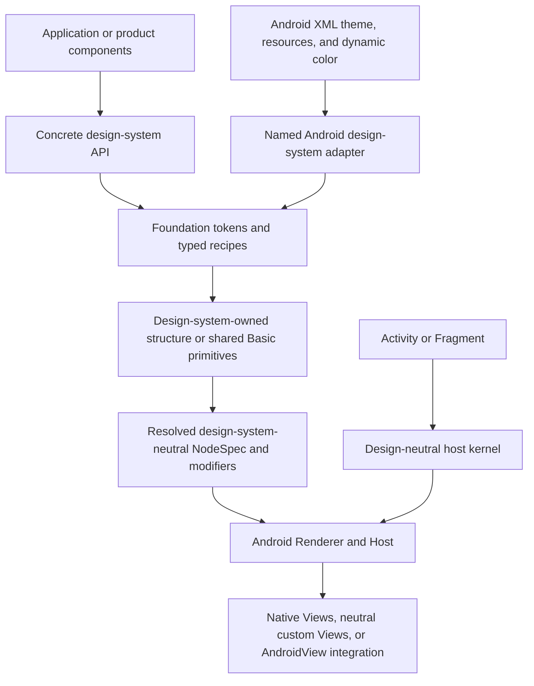

# Multi-Design-System Architecture and Integration Standard

## 1. Status and scope

This document is the normative architecture and onboarding standard for every design system hosted
by ViewCompose. It applies to Material 3, One UI, product-owned themes, and future design systems.
New work must follow these boundaries immediately. Known implementation gaps are listed in
Section 15 and tracked by the active
[multi-design-system execution plan](../project/plans/multi-design-system-high-fidelity.md).

ViewCompose is a design-system-neutral declarative runtime over the Android View engine. It is not
a Material facade, a skinning engine that can restyle any arbitrary component tree, or a second
Canvas-only widget toolkit. Android View remains the execution platform; design-system policy is
resolved above it.

This standard defines:

- the meaning and limits of multi-design-system support;
- ownership of tokens, recipes, component structure, host context, and rendering;
- how to choose native behavioral cores, DSL composites, and custom Views;
- how Material and Android XML themes integrate without becoming framework defaults;
- the acceptance gates for a new design system or component family; and
- the boundaries whose violation would create a future rewrite risk.

Compiler transformations and compiler-owned optimizations are outside scope. The framework maps
to Android View and must obtain its performance from stable state, resolved contracts, retained
nodes, focused patching, and appropriate native or custom View backends.

## 2. What multi-design-system support means

Multi-design-system support means that multiple design languages share one runtime, state model,
layout vocabulary, interaction foundation, renderer, lifecycle, diagnostics model, and Android
host. Each design system may still own different component APIs and structures.

It does **not** promise that one unrestricted component tree can be switched among unrelated
design systems with pixel-perfect results. Portability has three levels:

1. **Foundation portability:** state, layout, text, image, input, semantics, animation, graphics,
   and shared Basic primitives remain reusable.
2. **Semantic component portability:** a component whose roles, slots, states, and interaction
   contract are truly shared may use a common facade backed by a selected recipe.
3. **Structural specialization:** a component whose content order, slots, gesture state machine,
   or navigation model differs remains in the owning design-system module.

Applications normally choose one design system at a composition root. A product may offer a
bounded runtime switch, but switching replaces the root/session under one immutable bundle. The
framework does not support mutating a live design-system identity in place or mixing old and new
policy across overlays and delayed content.

## 3. Layer model

The execution and policy flow is:

Dependency ownership follows the repository's five-layer architecture:

- Kernel and UI Foundation define portable state, UI contracts, interaction, graphics, and
  design-neutral primitives.
- Android Engine mounts and updates Android Views from resolved contracts.
- A design-system module depends downward on reusable foundations and owns named policy.
- A platform integration with a design-system-specific external dependency is named and placed
  above the neutral engine.
- An application or aggregate assembles the chosen design system and integrations.

Execution order does not reverse dependency ownership. Android Renderer may execute a shape or
effect resolved by Material, but it must not import Material or ask which design system produced
that shape.

## 4. Constitutional invariants

Every design-system change must preserve these rules.

| Invariant | Required result |
| --- | --- |
| Design identity stays above the engine | Kernel, UI Foundation, Android Renderer, and neutral Host contain no `Material3`, `OneUi`, Cupertino, or product branches. |
| Values are resolved before rendering | Renderer receives geometry, color, typography, motion, semantics, effects, callbacks, and fallback strategy, not a component recipe or theme identity. |
| Tokens and recipes stay separate | Foundation tokens are immutable reusable semantics; typed recipes own component decisions; neither stores factories, callbacks, Android resources, or arbitrary behavior closures. |
| Behavior is preserved before appearance | Replacing a native widget requires evidence for input, focus, accessibility, state restoration, lifecycle, and performance before visual fidelity is accepted. |
| Material is a reference system, not the substrate | Material dependencies and Android theme interpretation remain in Material-named modules or integrations. |
| A root captures one coherent bundle | Theme, recipe, motion, capability, overlay, lazy content, and diagnostics observe the same design-system snapshot. |
| Fallback is explicit | API/OEM limitations report `Exact`, `Equivalent`, `Degraded`, or `Unsupported`; decoration may degrade, but behavior, semantics, bounds, and target state may not. |
| Public contracts do not leak backend types | Component callers do not depend on `MaterialButton`, framework custom View classes, or renderer implementation types. |
| Shared abstractions require independent evidence | A contract moves into Foundation or NodeSpec only after at least two materially different consumers prove the same semantics. |
| Defaults have observable provenance | Diagnostics can distinguish framework defaults, Android XML mapping, dynamic color, design-system static tokens, and application overrides. |

These invariants outrank short-term source reuse. Similar code in two design systems is cheaper than
a shared abstraction that couples their future component vocabularies.

## 5. Policy data boundaries

### 5.1 Foundation tokens

Foundation tokens express reusable semantic values: color roles, typography, spacing/density,
shape families, elevation, motion roles, and effects. They are immutable data with stable equality.
They do not contain:

- component factories or composable functions;
- Android `Context`, resources, theme attributes, or Drawables;
- callbacks, clocks, mutable state, or coroutine ownership;
- named design-system identities; or
- one union of all component variants from all design systems.

A token may exist only when it is consumed by a shared semantic or intentionally reserved and
documented. Adding tokens merely to mirror an external specification is not sufficient.

### 5.2 Typed component recipes

A recipe converts foundation tokens and component state into resolved component values. Recipes
belong to the concrete design system and remain typed, immutable, and behavior-free. They may
select sizes, shapes, state layers, arrangement values, and motion roles. They must not launch
animation, create Android Views, or reach back into an Android theme.

ViewCompose does not define one global recipe object containing every component. A common recipe
contract is justified only when multiple independent systems share the same roles and state model.

### 5.3 Component APIs and structure

The design-system module owns the public vocabulary that users recognize: variants, slots,
selection model, content arrangement, and component-specific defaults. Shared Basic primitives are
implementation foundations, not a requirement that every system expose the same public component
signature.

Product code that needs runtime portability should define a deliberately bounded product facade
and adapt it to each supported design system. The framework must not solve this by publishing a
union API with every Material, One UI, and future option.

### 5.4 Resolved execution contracts

`Modifier`, `NodeSpec`, shapes, draw commands, semantics, gesture contracts, and effect/fallback
descriptions form the execution boundary. They describe what Android Engine must do without
preserving the originating design-system name.

The renderer may branch on platform capability, node kind, resolved behavior, or effect strategy.
It may not branch on design-system identity. A new renderer field requires a stable execution
semantic, not merely a need from one component screenshot.

## 6. Component backend strategy

Android View can support the required design breadth, but no single backend is correct for every
component. ViewCompose recognizes three production strategies and one escape hatch.

| Strategy | Use when | Ownership rule | Typical examples |
| --- | --- | --- | --- |
| Native behavioral core | Android already solves complex editing, selection, scrolling, accessibility, or input and its visual shell can be controlled or decorated safely | Keep the behavior in Android Engine; keep named appearance policy in the design system | `EditText` editing core, RecyclerView, pager, native range input until replacement parity exists |
| DSL composite | The component is a small tree of ordinary Views and shared gestures/semantics can express its state machine | Structure and recipe stay in the design system; reusable interaction belongs in Foundation/gesture modules | Button, Switch with shared anchored drag, segmented control, navigation item |
| Neutral custom View | Canvas/layout control, child-count reduction, clipping, or performance requires one View and the semantics are reusable across systems | Generic View and resolved contract live in Android Engine; no named design vocabulary enters it | Shape/effect surfaces, framework progress drawing, reusable render hosts |
| Design-specific Android View escape hatch | A named system needs platform code or an external widget that cannot justify a neutral contract | Keep it in a named `-android` integration and mount through `AndroidView`; do not register it in the generic renderer by identity | A Material-only external component or OEM-specific interop |

Choose a backend in this order:

1. Identify the native behavior being retained or replaced; do not start with visual similarity.
2. Use a shared Basic primitive when resolved values and decoration are sufficient.
3. Keep a native behavioral core when replacing it would duplicate high-risk editing, scrolling,
   selection, accessibility, or input ownership.
4. Use a DSL composite when real child Views provide correct focus, semantics, and layout without
   material performance cost.
5. Add a neutral custom View only when measurement/drawing evidence or a reusable platform
   capability requires it.
6. Keep named or external platform code in the owning design-system integration until a second
   independent consumer proves a neutral execution contract.

A design system may use different strategies for different components. Consistency means shared
boundaries and validation, not forcing every component through the same implementation technique.

### 6.1 Promotion gates

Before a DSL composite replaces a native widget, tests must cover its applicable behavior:

- pointer slop, drag/click arbitration, cancellation, velocity/position settling, and RTL;
- keyboard, D-pad, hover, focus, pressed state, disabled state, and minimum target bounds;
- TalkBack roles, state, actions, collection position, and value/range semantics;
- controlled-state rejection, recomposition, save/restore, recycling, and disposal; and
- allocation, layout/draw cost, animation frame time, and screenshot stability.

Before a design-specific Android View becomes neutral renderer infrastructure, it must have two
independent design-system consumers, a name-free resolved contract, lifecycle cleanup, rollback,
accessibility behavior, and a demonstrated advantage over `AndroidView` integration.

## 7. Host and Android theme boundary

Android theme integration has two separate phases because Android Views may read style attributes
at construction time.

### 7.1 Phase A: platform context resolution

Before the root View tree is created, a named Android design-system adapter may resolve the
effective themed `Context`, resources, configuration, dynamic-color policy, and platform
capabilities. This phase is platform integration. It cannot be simulated later by only providing
new token values.

The neutral host kernel accepts an already resolved platform environment. It does not choose
Material, expose Material policy types, or silently wrap every root in a Material context.

### 7.2 Phase B: composition policy provision

Inside the composition root, the chosen design system provides one immutable snapshot of tokens,
recipes, motion, capability/fallback policy, and diagnostic provenance. UI Foundation and delayed
sessions consume that snapshot without reading Android theme attributes independently.

Root switching recreates the root/session with a newly resolved context and bundle. Saveable state
survives only according to its existing contract. Overlays, lazy item sessions, navigation page
sessions, and delayed content must either capture the owning snapshot or receive an explicit
refresh; they cannot fall back to process-global policy.

### 7.3 Host API rules

Overlay selection follows the same root boundary as Context and token resolution:

- `viewcompose-overlay-android` owns Material-free Android window transport, nested render
  containers, Toast, and lifecycle cleanup;
- named adapters supply only behavior with retained design-system value, currently Material and
  One UI Snackbar/modal-bottom-sheet presentation;
- neutral `setUiContent` constructs the neutral transport explicitly, while
  `setMaterial3UiContent` constructs the Material adapter explicitly;
- service discovery is a low-level neutral-host convenience and may never choose among design
  systems; and
- `UiIntegrationAttribution` travels with the design-system snapshot and records transport,
  presenter, conformance, and fallback for delayed overlay diagnostics.

One UI uses neutral Dialog, Popup, and Toast behavior plus the explicit
`viewcompose-overlay-oneui7-android` adapter for its Snackbar and bottom-dialog recipes. Without
that root adapter, those two capabilities remain truthfully `Unsupported`; classpath presence does
not select them, and a Material fallback is forbidden. Adding another design system does not
require another Activity/Fragment extension unless that system must resolve a different Android
Context before View construction.

- `viewcompose-host-android` is always design-system neutral.
- A generally named aggregate such as `viewcompose-android` must converge on neutral host entry
  points; Material convenience belongs in a Material-named module or compatibility facade.
- Neutral `setUiContent` overloads must not expose Material types in parameters, defaults, or
  return values.
- The first extraction should use internal, explicit assembly rather than publish a universal host
  plugin SPI. A public SPI is considered only after a second design system needs to change Android
  context construction and proves the same lifecycle contract.
- Context resolution and composition provision are separate contracts even when one convenience
  function performs both for callers.

## 8. Material 3 policy

Material 3 is the first-party reference design system because Android XML themes, dynamic color,
system components, and many application dependencies are Material-aware. First-party status means
excellent integration and the strongest conformance matrix; it does not give Material ownership of
the neutral engine.

The Material module owns:

- Android/AppCompat/Material attribute reading and semantic token mapping;
- dynamic-color policy and refresh lifecycle;
- Material recipes, components, defaults, and conformance decisions; and
- Material-specific Android integrations that have a measured behavioral or platform advantage.

Material Components widgets may be used selectively inside a Material-named module when they
provide behavior or platform integration that ViewCompose should not duplicate. They are not the
default renderer mapping for generic Button, Switch, Slider, or navigation nodes. Mapping every
generic node to Material widgets would leak Material context, geometry, dependencies, widget
state, and version behavior into every other design system.

The preferred order for a Material component is:

1. reuse neutral tokens, primitives, interaction, and renderer execution when they meet the
   specification;
2. preserve a native behavioral core and apply Material-owned decoration when behavior is costly;
3. use a Material-owned DSL composite or custom integration for structural differences; and
4. use a Material Components widget only when its retained value is documented and its public type
   does not escape.

## 9. Module ownership and naming

Existing design-system names remain `viewcompose-material3` and `viewcompose-oneui7`. Inserting a
generic word such as `design` or `theme` adds length without clarifying ownership and would create
artifact migration cost.

Split a module only when dependencies, platform code, publication, or release ownership differ.
Use a capability or platform suffix such as `-android` when the distinction is real. Do not create
one artifact per token family or component, and do not rename existing artifacts merely for visual
symmetry.

Ownership rules:

| Concern | Owner |
| --- | --- |
| Portable foundation tokens and Basic primitives | `viewcompose-ui-foundation` |
| Resolved name-free transport | `viewcompose-ui-contract` |
| Android View creation, patching, neutral custom Views | `viewcompose-renderer-android` |
| Low-level mounting and platform installation | `viewcompose-host-android` |
| Material XML/dynamic-color mapping and Material policy | `viewcompose-material3` or a Material-named Android integration |
| One UI tokens, recipes, and components | `viewcompose-oneui7` |
| One UI Android overlay presentation | `viewcompose-overlay-oneui7-android` |
| Product-specific design vocabulary | Product-owned design-system module |
| Material/OEM external widget interop | Named Android integration, mounted through a neutral boundary |
| Demo matrices and screenshot diagnostics | `app` and preview/test tooling |

## 10. Capability, fallback, and diagnostics

Every platform-sensitive visual path declares one conformance result:

- **Exact:** the specified geometry and effect are reproduced within the accepted tolerance.
- **Equivalent:** implementation differs but preserves the intended visual and behavioral role.
- **Degraded:** a documented lower-fidelity decoration is used while behavior and accessibility
  remain intact.
- **Unsupported:** no safe implementation exists; the component or option fails validation or is
  not exposed for that capability.

Fallback selection is based on resolved capability such as API level, device behavior, renderer
support, or reduced-motion preference, never a named design-system branch in Renderer.

Debug and screenshot diagnostics must expose at least:

- selected design-system and component recipe identity above the renderer boundary;
- source of each relevant token group: framework, Android XML, dynamic, design-system static, or
  application override;
- resolved backend: native core, DSL composite, neutral custom View, or named Android integration;
- conformance/fallback result and capability reason; and
- theme mode, layout direction, font scale, API/OEM, and stable screenshot anchors.

Diagnostics are architecture evidence, not optional demo decoration. A component cannot be
accepted when reviewers cannot tell which token source or backend produced the screenshot.

## 11. New design-system onboarding standard

Every new design system follows these stages in order.

1. **Scope declaration:** pin the external specification/version, supported components, Android
   API range, fidelity goal, and explicit non-goals.
2. **Vocabulary audit:** separate foundation semantics, component recipes, structural differences,
   and platform-only effects. Do not copy every external token into shared Foundation.
3. **Capability and behavior inventory:** for each component, list native behaviors at risk and
   choose native core, DSL composite, neutral custom View, or named Android integration.
4. **Internal pressure slice:** implement Surface, Button, input/toggle, TextField, and one
   structural navigation/selection component before publishing shared abstractions.
5. **Host integration decision:** state whether the system uses static tokens, Android XML,
   dynamic color, or a custom themed context. Keep context resolution above neutral Host.
6. **Resolution audit:** prove that named policy is fully resolved before NodeSpec/renderer and add
   source/dependency guards for new module edges.
7. **Conformance matrix:** record Exact/Equivalent/Degraded/Unsupported by component, state,
   API/OEM, theme mode, direction, font scale, input method, and accessibility mode.
8. **Diagnostics and demo:** provide distinct XML, static, and override token fixtures, stable tags,
   token-source inspection, backend inspection, and reproducible screenshots.
9. **Performance and rollback:** compare retained patch, allocation, layout/draw, and animation
   evidence against the baseline; isolate high-risk effects and custom controls behind reversible
   wiring.
10. **Publication:** add module catalog/manual entries, compiled samples, public API documentation,
    dependency metadata, immutable release changesets, and release-device acceptance.

No design system advances to publication because resting screenshots alone look correct.

## 12. Review checklist for component changes

Before implementation:

- Is the requirement a reusable execution semantic, a component recipe, or named structure?
- Which existing native behavior would be lost?
- Can current Basic primitives and modifiers express it without new renderer fields?
- Does the chosen backend keep design identity above the engine?
- Are XML, dynamic, static, and application token sources distinguishable?

Before retention:

- Do behavior, accessibility, lifecycle, screenshot, and performance gates pass?
- Does fallback preserve bounds, semantics, state, and input ownership?
- Are delayed sessions and overlays using the same immutable bundle?
- Did source/dependency guards reject Material or named-system leakage?
- Is the change independently reversible if the measured benefit is not retained?

## 13. Rejected patterns and rewrite triggers

The following are architecture violations:

- `when (designSystem)` or named-system factories in Android Renderer or neutral Host;
- a mega theme/token/recipe object containing every system's component variants;
- a universal component API that grows optional parameters for unrelated systems;
- treating Material-themed `Context` as the implicit context for all roots;
- mapping generic renderer nodes directly to Material Components widgets;
- exposing concrete Android or Material widget types through public component APIs;
- replacing native TextField, range, collection, or selection behavior without parity evidence;
- publishing a general plugin/registry only to avoid one explicit integration module;
- moving one-system geometry into NodeSpec before a stable execution semantic exists; and
- claiming arbitrary in-place high-fidelity switching across structurally different systems.

Repeated exceptions in these areas indicate that the owning layer is wrong and must be corrected
before adding more components. They are not extension points to normalize.

## 14. Evolution policy

Architecture and foundation work precede catalog growth. The required order is:

1. preserve and test the constitutional boundaries;
2. neutralize host/context ownership and dependency direction;
3. make token, recipe, capability, and diagnostic provenance explicit;
4. inventory and close shared interaction/accessibility gaps;
5. only then expand Material, One UI, or additional design-system components.

High-complexity changes require a baseline before production refactoring. Retain them only when the
measured result passes the plan's behavior, compatibility, visual, and performance gates; otherwise
revert the component wiring without weakening a shared invariant. Low-benefit module churn,
speculative extension points, and broad widget replacement are intentionally deferred.

## 15. Current implementation status and bounded gaps

The architecture-first convergence is implemented for the current pressure scope:

1. `viewcompose-android` is neutral, `viewcompose-material3-android` owns Material root-context
   resolution, and root, overlay, lazy, and navigation sessions retain one coherent context/local
   snapshot.
2. Material 3 and One UI each own a five-family token/recipe/component slice. They share neutral
   execution contracts but deliberately keep different public vocabularies and backend choices.
3. The Foundation-default audit retains semantic primitives as reusable values and classifies
   existing high-level defaults as compatibility policy. Named Material and One UI geometry stays
   in their modules; native editing, range, and selection behavior remains in Android cores.
4. The executable node/backend inventory covers every renderer node. Isolation guards reject named
   design systems in neutral layers, direct Material/One UI coupling, and Material dependencies in
   One UI.
5. Theme metadata reports base producer plus effective per-family origin. Design-system diagnostics
   report recipe, backend, conformance, capability, and fallback evidence. The Settings matrix
   asserts these production values for Android XML, static Material, and application overrides.
6. No current evidence justifies replacing native `EditText`, Slider/SeekBar, Checkbox, or Radio
   behavior. Material Switch retains the native core; One UI Switch uses the proven controlled
   anchored-drag composite. Future replacements reopen their component-specific parity gate.

One intentional gap remains: a second context-changing non-Material system has not demonstrated
the need for a public host-adapter SPI. Explicit assembly remains safer than a speculative plugin
surface. Release-device performance, Samsung visual acceptance, and Maven publication remain
release gates in the [active execution plan](../project/plans/multi-design-system-high-fidelity.md),
not exceptions below the design-system boundary.

## 16. Related documents

- [Architecture overview](./overview.md)
- [ADR-0004: Design-system resolution boundary](./decisions/0004-design-system-resolution-boundary.md)
- [ADR-0005: Design-system host and component backend boundary](./decisions/0005-design-system-host-and-component-backend-boundary.md)
- [Theming guide](../guides/theming.md)
- [NodeSpec model](./node-spec.md)
- [Multi-design-system execution plan](../project/plans/multi-design-system-high-fidelity.md)
