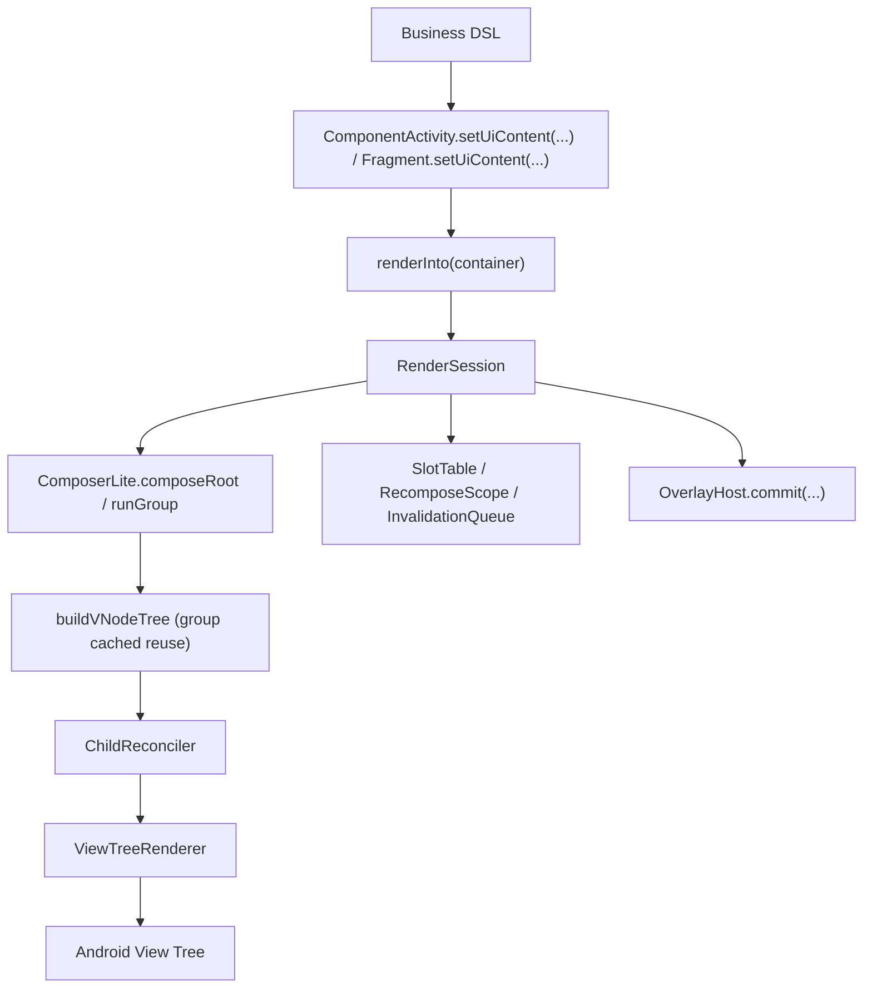

# ViewCompose Architecture

## 1. Purpose

This document is the **current architecture specification** for `ViewCompose`. It defines:

1. module responsibilities and boundaries;
2. the core execution path;
3. placement rules for new code; and
4. constraints that every change must preserve.

If an implementation needs to depart from this specification, update this document before changing the code.

The historical long-form snapshot is available at [ARCHITECTURE_FULL_2026-03-06.md](https://github.com/ViewCompose/ViewCompose/blob/main/docs/archive/ARCHITECTURE_FULL_2026-03-06.md).

## 2. Current baseline (2026-07)

- Technology: Kotlin on the Android View system.
- SDK: `minSdk 24`, `compileSdk 36`.
- Modules: `:viewcompose-runtime`, `:viewcompose-text-core`, `:viewcompose-ui-contract`, `:viewcompose-navigation-core`, `:viewcompose-navigation` (incubating on a feature branch), `:viewcompose-animation-core`, `:viewcompose-animation`, `:viewcompose-gesture-core`, `:viewcompose-gesture`, `:viewcompose-graphics-core`, `:viewcompose-graphics`, `:viewcompose-shadow-android`, `:viewcompose-widget-core`, `:viewcompose-widget-constraintlayout`, `:viewcompose-renderer`, `:viewcompose-host-android`, `:viewcompose-overlay-android`, `:viewcompose-image-coil`, `:viewcompose-lifecycle`, `:viewcompose-viewmodel`, `:viewcompose-preview-core`, `:viewcompose-preview-runner`, `:viewcompose-preview`, `:viewcompose-benchmark`, and `:app`.

### 2.1 Module responsibilities

| Module | Responsibility | Constraint |
| --- | --- | --- |
| `viewcompose-runtime` | State and read-dependency observation (`state/observation`) | Pure Kotlin/JVM; production sources must not import `android.*` or `androidx.*`, and the build must not add AndroidX dependencies. |
| `viewcompose-text-core` | Complete plain-text editing state, including text, selection, composition, `EditingBuffer`, input transformations, undo, and redo | Pure Kotlin/JVM with no Android types; offsets use UTF-16 to match platform editing protocols. |
| `viewcompose-ui-contract` | Pure Kotlin UI contracts such as `Modifier`, `VNode`, `NodeSpec`, layout enums, and collection/state protocols | Production sources must not import `android.*` or `androidx.*`. |
| `viewcompose-navigation-core` | System-navigation kernel: routes, back stack, two-phase transactions, and page-lifecycle planning | Pure Kotlin/JVM with no Android or AndroidX types; page sessions and platform back adapters do not belong here. |
| `viewcompose-navigation` | Android system-navigation integration: destination owners, page sessions, `NavHost`, and back adapters | Depends on navigation-core and host-android; must not change the app's default entry point before stabilization, and host-android must not depend back on it. |
| `viewcompose-animation-core` | Animation kernel: `AnimationSpec`, `Easing`, converters, engine, and `TransitionCore` | Pure Kotlin/JVM; no Android dependency. |
| `viewcompose-animation` | Animation DSL integration: `animate*AsState`, `Animatable`, transitions, `AnimatedVisibility`, and animated content | Public-call API; runtime driving uses `MonotonicFrameClock` plus coroutines and does not depend directly on Android View animations. |
| `viewcompose-gesture-core` | Gesture policy kernel: axis lock, transform slop, and swipe settling | Pure Kotlin/JVM; the renderer only adapts events and invokes this kernel. |
| `viewcompose-gesture` | Platform-independent gesture DSL: `pointerInput`, `combinedClickable`, dragging, anchored dragging, and transforms | Defines modifier and state entry points only; policy decisions stay in gesture-core. |
| `viewcompose-graphics-core` | Platform-independent graphics kernel: geometry, paths, brushes, draw commands, and draw caches | Pure Kotlin/JVM; defines graphics models only. |
| `viewcompose-graphics` | Graphics DSL integration: `Canvas`, `drawBehind`, `drawWithContent`, and `drawWithCache` | Defines business-facing APIs and contract mappings without depending directly on Android Canvas. |
| `viewcompose-shadow-android` | Optional advanced-shadow backend, cache, and Android drawing implementation | Depends only on the renderer's minimal decoration SPI; renderer and host do not depend on it; installation uses `ServiceLoader` or an explicit call. |
| `viewcompose-widget-core` | DSL, theme/defaults, locals, and overlay declaration contracts | Does not depend on renderer and does not define Android host entry points. |
| `viewcompose-widget-constraintlayout` | ConstraintLayout component DSL | Contains only the DSL and scopes; platform rendering remains in renderer. |
| `viewcompose-renderer` | Android View rendering: reconciliation, binders, patches, and containers | Consumes ui-contract and does not contain business DSL. |
| `viewcompose-host-android` | Android host runtime and entry points: `setUiContent`, `renderInto`, `RenderSession`, native View interop, and host Local injection | Executes and injects platform behavior without business DSL. |
| `viewcompose-overlay-android` | Android overlay host and presenters for dialogs, popups, bottom sheets, snackbars, and toasts | Platform implementation only; it does not depend on renderer resources. |
| `viewcompose-image-coil` | Remote-image loading bridge | Integrates through platform-independent target contracts and does not feed Coil concerns back into the renderer core. |
| `viewcompose-lifecycle` | Lifecycle-aware collection APIs and lifecycle Local entry points | Does not contain Android View implementations or add host-injection logic. |
| `viewcompose-viewmodel` | ViewModel and SavedStateHandle collaboration APIs and ViewModel Local entry points | Does not contain Android View implementations or add host-injection logic. |
| `viewcompose-preview-core` | Preview annotations, deterministic configuration, and cross-process request/result protocols | Pure Kotlin/JVM with no Android, Compose, or IDE SDK dependency. |
| `viewcompose-preview-runner` | Native View static rendering, image export, and structured diagnostics in an isolated process | May use Android/Layoutlib; must not depend on Compose or the IDE SDK. |
| `viewcompose-preview` | Development previews and screenshot regression: Compose Preview bridge, `PreviewCatalog`, and Paparazzi | Development-only, excluded from app runtime entry points, and must not depend on `:app`. |
| `viewcompose-benchmark` | Macrobenchmark entry points and performance-regression data collection | Contains neither business demos nor framework semantics. |
| `app` | Demos, manual verification, and UI-test entry points | Contains no framework-core implementation. |

#### 2.1.1 Hard dependency direction

Dependencies flow one way from the foundation through optional capabilities and tooling to the demo app. A higher layer may consume a lower layer; a lower layer must not depend on an optional implementation for reuse.

1. The foundation includes runtime, pure-Kotlin kernels, UI contract, widget-core, renderer, lifecycle/viewmodel, and host-android. Each foundation module has an explicit Gradle project-dependency allowlist. A new dependency must first be justified as a stable foundation contract.
2. Navigation, animation, gesture, graphics, shadow, ConstraintLayout, overlay, and image-coil are optional capabilities. They may depend on the foundation, but the foundation must not depend on them. The core render path must compile and run when none is present.
3. Preview, preview worker/runner/Gradle plugin, and benchmark are tooling. Runtime and optional-capability modules must not depend on tooling, and no framework module may depend on `app`.
4. Every new `viewcompose-*` module must be classified as foundation, optional capability, or tooling in the same change. `verifyModuleDependencyBoundaries` rejects unclassified modules, dependencies outside a foundation allowlist, and optional-capability dependencies on tooling.
5. `qaQuick` always runs the boundary check. A compilable demo, an already-present dependency, or review approval is not a reason to bypass it.

### 2.2 Architectural assessment

The project is a maintainable View-based declarative UI v1:

1. The main-tree update model uses dirty node-group recomposition through SlotTable Lite plus root-tree reference reuse.
2. Reusable containers such as lists and pagers use independent session refresh paths.
3. Overlay declarations and platform implementations are separated.
4. Node semantics are exclusively `NodeSpec`; the former `Props` path no longer exists.
5. Lifecycle and ViewModel collaboration APIs live in dedicated modules while host auto-injection remains intact.
6. Animation and gesture use kernel, DSL, and Android interop layers.
7. Graphics uses core, DSL, renderer pipeline, and host interop layers.
8. ConstraintLayout separates its widget DSL from renderer platform mapping and covers anchors, dimensions, bias, baseline links, circles, guidelines, barriers, chains and weights, Flow, Group, Layer, Placeholder, decoupled constraint sets, and advanced match-constraint parameters.
9. Theme tokens are in a consumption-closure phase: every new token must be consumed by defaults/composite defaults or explicitly registered as a reserved semantic palette entry.
10. Text input has one source of truth, `TextFieldState`. The pure-Kotlin editor owns value, selection, composition, and history; renderer's `ViewComposeEditText` only adapts Android `Editable` and `InputConnection`.
11. System navigation incubates independently: first stabilize the pure-Kotlin back-stack transaction and page-lifecycle kernel, then integrate Android page sessions without changing current Activity or Fragment host entry points before stabilization.

### 2.3 `app` directory baseline

The app separates entry points from demonstrations:

1. `app/src/main/java/com/viewcompose/activity/entry`: root activities such as `MainActivity` and render-host entry points.
2. `app/src/main/java/com/viewcompose/activity/demo/pages/<domain>`: activity routes grouped by `core`, `interaction`, `advanced`, and `quality`.
3. `app/src/main/java/com/viewcompose/activity/demo/sandbox`: non-core animation, gesture, and graphics experiments.
4. `app/src/main/java/com/viewcompose/demo/core`: shared catalog, theme session, test tags, and section helpers.
5. `app/src/main/java/com/viewcompose/demo/pages/<feature>`: feature demos such as foundations, layouts, input, and feedback.
6. `app/src/androidTest/java/com/viewcompose`: demo and UI regression tests.

### 2.4 `viewcompose-renderer` directory baseline

Renderer code is grouped by responsibility instead of flattened into one package:

1. `NodeType`, `VNode`, `NodeSpec`, and their subtypes exist only in ui-contract. Renderer must not create a mirror `com.viewcompose.renderer.node` contract.
2. `view/.../view/container/{core,layout,collection,navigation,input}` maps Android View containers by family.
3. `view/.../view/tree/binder/core` owns the bind pipeline, factory, differ, plan, registry, and modifier application. `NodeBinderDescriptors` is the single source for bind/patch/diff metadata, descriptor files live under `core/descriptor/`, and `ViewModifierApplier` remains a facade whose details are split under `core/modifier`. Container reuse, motion, and focus-follow policy comes from widget DSL through `NodeSpec`, not modifier extraction.
4. `view/.../view/tree/binder/widget` contains binders grouped by widget family. Text fields synchronize full editing snapshots through `ViewComposeEditText` and `AndroidTextFieldController`; ordinary recomposition must not unconditionally call `setText()` or move the cursor to the end.
5. `view/.../view/lazy/{adapter,focus,layout,reuse,session,state}` separates lazy-container capabilities. `LazyListState` receives immutable layout snapshots from RecyclerView scroll/layout/adapter observers and must not reset the anchor when rebound to the same RecyclerView. Item key, content type, span, and sticky kind belong to ui-contract and map to stable IDs, view types, `SpanSizeLookup`, and pinned-header decoration on Android.

## 3. Core execution path

## 4. Hard boundaries

### 4.1 Platform implementation

1. Android dialog, popup, toast, and snackbar host implementations live only in overlay-android.
2. widget-core retains platform-independent declaration contracts and runtime composition capabilities.
3. Demo-only logic must not flow back into framework modules.

### 4.2 `Modifier`, `NodeSpec`, and theme

1. `Modifier` carries general decorations and scoped parent data.
2. Component semantics use component DSL parameters and `NodeSpec`.
3. Theme defaults flow from `Theme` to `Defaults`; theme is not a general-purpose modifier.
4. `AndroidThemeBridge` has a snapshot-reader layer and a token-mapper layer. The reader only reads Android/AppCompat/Material fields; the mapper performs semantic mapping and fallbacks.
5. Best-effort `surfaceTint` and uniform `shapeAppearance*Component` mapping is allowed. The bridge must not guess non-uniform corner shapes or three control-size tiers merely to increase coverage.
6. `controls` remain framework-owned defaults unless Android exposes a stable, uniform source. Scattered widget styles must not become global token truth.
7. ui-contract modifier files contain only globally stable semantics. Policies that apply to one container belong in its DSL parameters and `NodeSpec`.
8. Do not reintroduce `Props`, `TypedPropKeys`, `PropKeys`, or `node.props`.
9. Constraint parent data (`layoutId`, `constrainAs`, and `constrain`) is valid only for ConstraintLayout children; an invalid host must produce a validator warning.
10. Composite components must transfer complete text styling through `NodeSpec`, including font size, weight, family, letter spacing, line height, and font-padding inclusion.

See [Modifier architecture](modifier.md), [NodeSpec architecture](node-spec.md), and [theming](../guides/theming.md).

### 4.3 Host integration

1. Activity and Fragment `setUiContent(...)` entry points do not expose internal `RenderSession`; the host disposes it automatically, using the Fragment view lifecycle where applicable.
2. The default overlay factory uses `OverlayHostDefaults.androidOrNoOp(...)`: discover Android implementations through `OverlayHostFactoryProvider` and `ServiceLoader`, otherwise fall back to no-op with a diagnostic.
3. overlay-android registers its provider through `META-INF/services`; string reflection is forbidden.
4. Public host callbacks expose only widget-core diagnostic types; renderer diagnostic types remain internal adapters.
5. System-bar insets use `Modifier.systemBarsInsetsPadding(...)`, not a global Activity option.
6. host-android atomically installs the render engine, frame scheduler, and composition coroutine context through `installRenderSessionPlatform(...)`. A session captures one platform snapshot, and missing or duplicate installation fails immediately rather than degrading piecemeal.

### 4.4 Lazy session containers

Every container with lazy creation and holder/session reuse is a first-class architectural object. It must provide:

1. a visible-content refresh path when structure is stable;
2. refresh behavior for an empty diff;
3. recycle/dispose behavior aligned with lifecycle; and
4. framework-managed RecyclerView/ViewPager2 defaults of a local pool and system animator, with per-container `reusePolicy`, `motionPolicy`, and vertical `focusFollowKeyboard` overrides.

Use the [session-container checklist](session-containers.md).

### 4.5 Environment and Locals

1. Android host entry points inject `UiEnvironment(androidContext = root.context)` by default, while business code may override values in a local subtree.
2. Renderer consumes resolved `NodeSpec` and platform values; it does not depend on widget-core Environment or Local implementations.
3. Renderer dp/sp conversion goes through its shared `DimensionUtils.kt`; containers must not duplicate density helpers.
4. `AndroidEnvironmentBridge` is the only Android environment extraction entry point.
5. Custom tokens and built-in Locals use `uiLocalOf`, `UiLocals.current`, `ProvideLocal`, and `ProvideLocals`; do not add a new dedicated `ProvideXxx` pattern.
6. Local snapshot/restore behavior must propagate consistently through lazy containers and overlays.
7. Lifecycle and ViewModel Locals use the public packages `com.viewcompose.lifecycle` and `com.viewcompose.viewmodel`, while `AndroidHostBridge` performs default injection.

### 4.6 SlotTable Lite recomposition

1. `ComposerLite` is the only composition kernel. `RenderSession` schedules initial composition and incremental recomposition without a session-level whole-tree read observer. Invalidations are aligned to `Choreographer` frames.
2. `UiTreeBuilder.emit(...)` establishes group boundaries. A clean group reuses its prior `VNode` reference; only a dirty group rebuilds.
3. State-read invalidation and changed `emit` inputs both enter the deduplicating `InvalidationQueue`.
4. Structural drift in a sibling group key/order falls back to the nearest stable ancestor subtree and reports one warning; silent corruption is forbidden.
5. `LocalContext` snapshots and restores per group.
6. Composition APIs such as `remember`, `key`, effects, and `rememberCoroutineScope` require an active `ComposerLite`; no fallback slot/effect store or silent out-of-composition behavior is allowed.

### 4.7 Text editing

1. text-core is the sole platform-independent source of truth for text, directional selection, IME composition, editing transactions, and undo history.
2. `TextField`, `TextArea`, and `SearchBar` accept stable `TextFieldState`; do not restore a parallel `String + onValueChange` API.
3. Android renderer preserves native IME, accessibility, hardware keyboard, and selection behavior through AppCompatEditText instead of implementing its own text layout or full `InputConnection`.
4. Native input is merged at InputConnection/batch-edit boundaries. State-to-View updates use minimal `Editable.replace()` calls and restore selection/composition.
5. `InputTransformation` applies only to user input; programmatic `TextFieldState.edit` bypasses it.
6. Save/restore persists text and selection, not IME composition or undo/redo history.
7. Rich-text spans, inline attachments, and unified receive-content require a separate document model; Android `Spannable` must not enter core contracts.

### 4.8 State snapshots and composition transactions

1. `MutableState` writes go through snapshot transactions, and `SnapshotMutationPolicy` defines equality and conflict behavior.
2. Concurrent mutable-snapshot apply first checks equality, then attempts merge, and otherwise returns failure.
3. Each composition round reads a consistent snapshot. Derived-state invalidation observes snapshot versions rather than one global dirty bit.
4. `rememberUpdatedState` guarantees visibility after recomposition, not immediate visibility to an effect during the same composition phase.
5. `prepareRoot()` creates a candidate composition. Slots, observations, `RememberObserver`, and effect lifecycles commit only after renderer success and abort together on failure.
6. `DisposableEffect`, `SideEffect`, and `onRemembered` execute only during commit; abandoned candidate values receive `onAbandoned`.
7. `RenderSession` owns the sole composition coroutine tree. Its `SupervisorJob` isolates children, and disposal cancels every descendant.
8. `LaunchedEffect`, `produceState`, state collection, and animation remain children of that tree. Additional contexts passed to composition APIs must not contain a `Job`.
9. Writing snapshot-backed mirror state and immediately reading it during the same composition may return the old snapshot; control flow must use the live kernel value.
10. Composition transactionality covers slots, observations, effects, and VNode publication; it does not promise atomic rollback with arbitrary global snapshot writes or Android View patches.
11. A touched-scope journal copies rollback state only for executed or changed scopes. Duplicate invalidations for one scope in a frame coalesce, while invalidations raised during composition still advance the version for a follow-up pass.
12. An equivalent regenerated VNode must reuse its old reference so renderer can use O(1) `SkipSubtree`.
13. There are no compiler-generated restart groups. Components spanning sibling VNodes may use node-free `RecomposeBoundary`, with captured values declared explicitly as inputs.

### 4.9 Render scheduling and transactions

1. Explicit `RenderSession.render()` and the first frame execute immediately; state invalidations use `FrameAlignedRenderDispatcher` and coalesce to one commit per frame.
2. Disposal cancels pending frame callbacks. Lazy item and overlay surface sessions keep immediate rendering to avoid blank first display.
3. Recursive patching shares one apply transaction. Removed resources are released only after the whole tree succeeds.
4. Failure restores the old VNode, mounted children, layout parameters, and View order as far as possible and releases newly created nodes.
5. `AndroidView.update`, `onReset`, and native-View configuration must be replayable. Irreversible external actions belong in `onCommit` after transaction success.
6. The mutation journal records only actually changed mounted nodes and ViewGroups; stable subtrees are not snapshotted.
7. `AnimatedSizeNodeWrapper` preserves unchanged VNode/list references and converts once per frame; no-animation paths must not recursively copy trees.
8. `NodeBindingDiffer` runs before modifier/layout-parameter resolution, and `SkipSubtree` performs no resolution or repeated preflight.
9. Structural-depth and per-node-type binding statistics are collected only when debug or diagnostics callbacks enable them.
10. Recoverable failures are reported through `RenderFailure(phase, recovery, frameId, operation, nodeKey)`; logs are not an observability API.

### 4.10 Renderer binding complexity

1. Binder registry and differ mappings derive from `NodeBinderDescriptors`; adding a node or patch changes the descriptor source, not parallel maps.
2. Descriptor sources live under `view/tree/binder/core/descriptor/`; do not flatten new `NodeBinder*.kt` files into `core/`.
3. `ViewModifierApplier` orchestrates only. Styling, interaction, insets, and container policies live in focused objects under `core/modifier`.
4. A shortcut around descriptors is an architecture violation and must be corrected in the same iteration.

### 4.11 Module package roots

1. Each module has one responsibility-aligned package-root prefix and may organize subpackages beneath it.
2. The rule covers `src/main`, `src/test`, and `src/androidTest`; tests are not exempt.
3. Android module namespace matches its package root, except the Kotlin/JVM ui-contract module.
4. Lifecycle and ViewModel Local APIs remain in their dedicated public packages and modules, not widget-core.

### 4.12 Development previews

1. Platform-independent annotations, deterministic configuration, and process protocols live in preview-core without Android, Compose, or IDE SDK dependencies.
2. Native static mounting, measurement, layout, drawing, and diagnostic export live in preview-runner without Compose or IDE SDK dependencies.
3. Compose Preview adapters, `PreviewCatalog`, and Paparazzi assets live in preview and do not flow into app or core runtime modules.
4. Android Studio Preview and Paparazzi share one `PreviewCatalog`; duplicate examples are forbidden.
5. Preview worker and IDE plugin communicate through a versioned structured protocol, and business render code never runs in the IDE process.
6. Preview may simulate static overlay content, while instrumentation covers real window behavior.
7. A new component or important composite adds its `PreviewSpec` and Paparazzi baseline in the same change.

### 4.13 Animation and gesture

1. Animation uses animation-core plus animation; gesture uses gesture-core plus gesture.
2. `graphicsLayer` is the main animation carrier and wins when its alpha, offset, elevation, or z-index field conflicts with the same standalone semantic.
3. Android-specific high-level animation enters only through host-android interop.
4. Gesture arbitration consumes in this order: `pointerInput`, transform/drag/swipe, then `combinedClickable`. A consumed pointer-input result short-circuits the rest.
5. Renderer preserves direction lock, slop, and priority. List/pager motion remains opt-in and compatible with reuse policy.
6. `AnimatedVisibility` defaults to fade-in plus expand-in and shrink-out plus fade-out, participates in parent size animation through `AnimatedVisibilityHost`, and removes its subtree only after all exit animations finish.
7. Transform activates only after pan, zoom, or rotation motion crosses touch slop. Once active it emits one combined delta per frame and only then disallows parent interception.
8. Anchored settling uses velocity first, distance second, and nearest anchor last. The distance threshold is `max(touchSlop * 2, segmentSpan * 0.35)`.
9. `animateContentSize` uses an `AnimatedSizeHost` with real measured-size interpolation and parent relayout, not graphics-layer scaling. Its child follows the current host size in both expansion and collapse.
10. `Animatable` normally obtains the frame clock from `rememberAnimatable(...)`; non-composition callers may bind one explicitly.
11. Gesture policy belongs in gesture-core; renderer must not add parallel axis-lock, slop, or settling branches.
12. `combinedClickable` participates only when enabled and at least one click, double-click, or long-click callback exists.

### 4.14 Graphics

1. Graphics is layered as graphics-core, business DSL, Android renderer execution, and host Android interop.
2. `verifyGraphicsCorePurity` prevents Android imports in graphics-core.
3. `drawBehind` runs before content; `drawWithContent` controls content placement explicitly; multiple draw modifiers execute in stable chain order.
4. `drawWithCache` rebuilds cached commands only when dependencies change.
5. Android-only `RenderEffect`, `RuntimeShader`, and Drawable/Canvas bridges enter through `AndroidGraphicsInterop`.
6. Rounded rectangles use a fast path for uniform corners and `Path.addRoundRect` for non-uniform corners.
7. Drawable image drawing applies alpha, blend, color filter, and image filter, then restores original bounds.
8. `ImageFilterModel.Chain` must execute. The current blur chain combines radii recursively by Gaussian variance before applying the platform filter.

### 4.15 Advanced shadow decoration

1. ui-contract owns the platform-independent immutable `UiShadow` and ordered shadow modifiers.
2. Renderer owns only the minimal `AndroidViewDecorationBackend` protocol, generic hosts, active-decoration index, and independent z-index ordering. Renderer and host do not depend on a concrete shadow module.
3. shadow-android owns Android rasterization, caching, backend choice, and diagnostics, installed through `META-INF/services` or `ShadowDecorationLayer.install()`.
4. Without a backend, shadow modifiers degrade to a stable no-op while core rendering, lazy containers, pagers, tabs, previews, and hosts still compile and run.
5. Necessary roots remain ordinary `FrameLayout`. `renderInto` adds a generic host only when a top-level node actually needs decoration/non-zero z-index and the current container lacks the protocol; nested decorations draw in the nearest framework layout.
6. With no active decorated child, `drawChild` performs one parent-level fast check and delegates directly to native drawing. With decoration, each child is looked up at most once for both drawing planes. Custom child order is disabled when every z-index is zero.
7. Containers draw outer shadows before child content and inner shadows after complete child content and foreground, without extra business Views.
8. Advanced shadows do not affect measurement, layout, hit testing, focus, or accessibility. z-index, Material elevation, and exact shadow remain distinct semantics.
9. Multiple layers preserve declaration order. Outer shadows may exceed child bounds but obey the nearest viewport/explicit clip chain; inner shadows are clipped to the shape.
10. Static raster cache keys include size, density, layout direction, shape, and complete specifications. Translation, scale, rotation, or alpha alone does not rebuild raster content.
11. `ShadowRenderPolicy.Auto` currently selects `ExactBitmap`; the API 29+ `RenderNodeDisplayList` backend remains explicit and experimental until release-device data proves a stable benefit.
12. Lazy recycling, node removal, transaction rollback, and session disposal remove shadow specifications. Parent indexes must not strongly retain Views globally, and process caches contain only immutable rasters.

See the [advanced shadows guide](../guides/shadows.md).

### 4.16 Semantics and accessibility

1. Accessibility declarations use `Modifier.semantics { ... }` and `SemanticsConfiguration`; `contentDescription` is only a convenience entry point.
2. The platform-independent contract covers description, state, role, heading, live region, selected/checked/enabled, error, progress, pane title, click label, descendant merging, and hidden subtrees.
3. Renderer maps semantics through native View properties and `AccessibilityNodeInfoCompat`; it does not maintain a separate accessibility tree.
4. Removing semantics during patch or reuse restores the View's prior content, state, delegate, heading, live-region, and importance values.
5. Native semantics of TextField, list, slider, and similar controls remain unless an explicit structured semantic overrides a field.

### 4.17 System navigation

1. Routes, back stack, navigation transactions, and page-lifecycle planning live in pure-Kotlin navigation-core.
2. AndroidX owners, system back dispatch, and page View containers belong only in the Android navigation integration.
3. Each destination owns a page `RenderSession`; the back stack must not be modeled as ordinary conditional branches in one root session.
4. Navigation uses prepare/commit/rollback. A candidate's first render must succeed before publishing the new stack or pausing the current page.
5. A hidden page retained on the stack stays `CREATED` and keeps state ownership. Multiple interactive adaptive panes may be `RESUMED`. A permanently removed page reaches `DESTROYED` only after its exit transition and then releases resources.
6. Activity/Window is the root platform host, not a destination, and existing Activity/Fragment entry points remain unchanged before navigation stabilizes.
7. Candidate destinations render synchronously in an unattached container and stage hidden. Rollback releases both page session and entry owner.
8. Reusing a committed destination session refreshes its latest `UiLocalSnapshot` and content closure explicitly.
9. Pop refreshes the page being revealed before publishing the stack. Refresh failure leaves the prior stack, visible page, and lifecycle intact.
10. Reentrant commands enter one main-thread serial queue. Commands created while a candidate later fails are discarded with that candidate.
11. An unrecoverable post-commit effect failure places the coordinator in `Failed` and rejects later commands.
12. Adaptive panes alter only the visible set and native View layout for one committed stack. They do not create parallel navigation state, rebuild visible entry owners, or refer to entries outside the active stack.

See the [navigation guide](../guides/navigation.md).

## 5. Current hotspots and risks

1. `ViewTreeRenderer` remains a complexity hotspot; add focused helpers instead of expanding its main class.
2. The current model combines node-group recomposition with root-level traversal scheduling. Future work should improve group-key diagnostics and fine-grained skip hit rates.
3. widget-core no longer depends directly on renderer. Preserve the runtime/ui-contract/widget-core/renderer/host-android layering.
4. Lazy session regression covers grid and both pager orientations. Lazy P1 includes structured item DSL, observable layout state, sticky headers, content type/span, prefetch, and boundary behavior.
5. `AndroidHostBridge` now lives in host-android. A future multiplatform effort should further isolate Android-specific theme and environment bridges that remain in widget-core.

## 6. Required change checklist

Every architecture-related change must include:

1. module and directory ownership review;
2. updates to this document and affected specifications;
3. unit or instrumentation regression coverage appropriate to the capability; and
4. a demo verification path.

See the [project workflow](../project/workflow.md).

## 7. Related documents

1. [Unified capability roadmap](../project/roadmap.md)
2. [Performance](../tooling/performance.md)
3. [State snapshots](state-snapshots.md)
4. [Documentation home](../README.md)
5. [System navigation](../guides/navigation.md)
