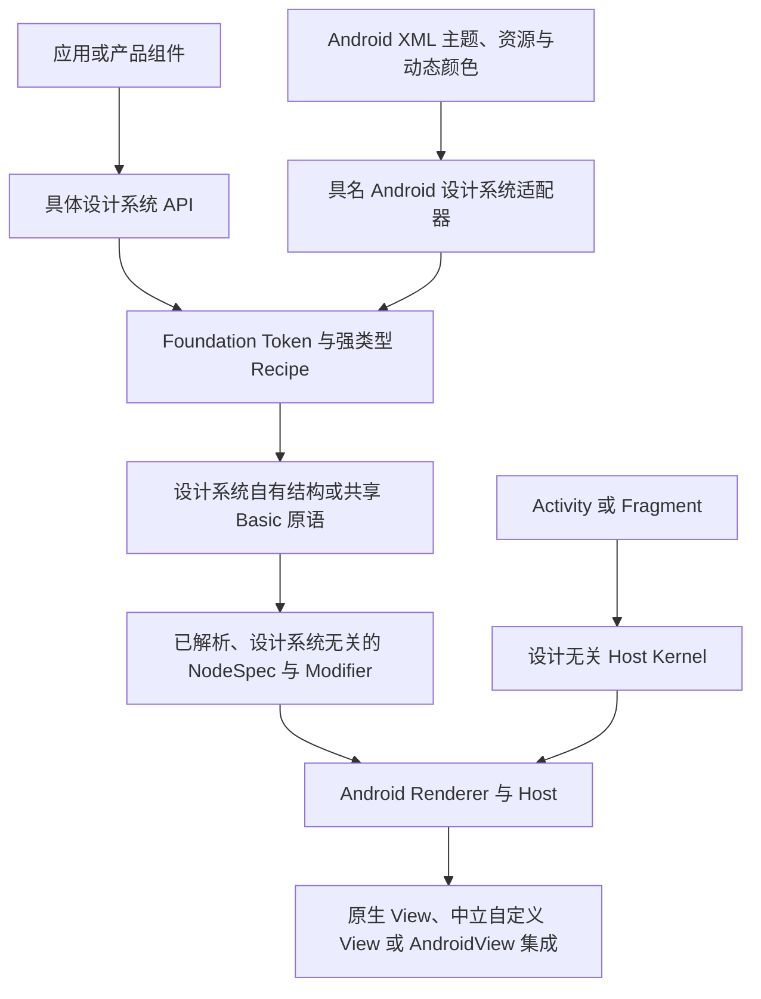

# 多设计系统架构与接入标准

## 1. 状态与范围

本文档是 ViewCompose 承载所有设计系统时必须遵守的规范性架构与接入标准，适用于 Material 3、
One UI、产品自有主题以及未来新增的设计系统。所有新增工作必须立即遵守这些边界。当前已知实现
缺口列在第 15 节；已完成的实现证据保留在
[多设计系统执行归档计划](https://github.com/ViewCompose/ViewCompose/blob/main/docs/archive/multi-design-system-high-fidelity.md)。

ViewCompose 是构建在 Android View 引擎之上的设计系统无关声明式运行时。它不是 Material 的
外观封装，不是可以任意重绘任何组件树的换肤引擎，也不是第二套只基于 Canvas 的控件工具包。
Android View 继续承担执行平台；设计系统策略必须在其上层完成解析。

本标准定义：

- 多设计系统支持的含义与边界；
- Token、Recipe、组件结构、宿主 Context 与渲染的所有权；
- 如何选择原生行为内核、DSL Composite 和自定义 View；
- Material 与 Android XML 主题如何接入且不成为框架隐式默认值；
- 新设计系统或组件族的验收门禁；以及
- 哪些边界一旦破坏会带来未来推倒重做的风险。

编译器转换和由编译器实现的优化不在范围内。框架最终映射到 Android View，性能应来自稳定状态、
已解析契约、节点复用、聚焦 Patch，以及恰当选择的原生或自定义 View 后端。

## 2. 多设计系统支持的含义

多设计系统支持是指：多个设计语言共享同一套 Runtime、状态模型、布局词汇、交互基础、Renderer、
生命周期、诊断模型和 Android Host；不同设计系统仍可拥有不同组件 API 和结构。

它**不承诺**一棵不受限制的组件树可以在任意无关设计系统之间切换，并始终获得像素级高保真。
可移植性分为三级：

1. **基础能力可移植：**状态、布局、文本、图片、输入、语义、动画、图形与共享 Basic 原语可以复用。
2. **语义组件可移植：**只有角色、Slot、状态和交互契约确实相同的组件，才可以使用由所选 Recipe
   驱动的公共 Facade。
3. **结构特化：**内容顺序、Slot、手势状态机或导航模型不同的组件，必须保留在所属设计系统模块。

应用通常在 Composition Root 选择一个设计系统。产品可以提供受约束的运行时切换，但切换必须在
一个新的不可变 Bundle 下替换 Root/Session。框架不支持就地修改存活的设计系统 Identity，也不允许
Overlay 和延迟内容同时观察到新旧策略。

## 3. 分层模型

执行与策略流如下：

依赖所有权遵循仓库的五层架构：

- Kernel 与 UI Foundation 定义可移植状态、UI 契约、交互、图形与设计无关原语。
- Android Engine 根据已解析契约挂载和更新 Android View。
- 设计系统模块向下依赖可复用基础能力，并持有具名策略。
- 带设计系统专属外部依赖的平台集成必须具名，并放在中立引擎之上。
- 应用或聚合模块负责组装选定设计系统和集成。

执行顺序不会反转依赖所有权。Android Renderer 可以执行 Material 解析出的 Shape 或 Effect，
但不能导入 Material，也不能询问 Shape 来自哪个设计系统。

## 4. 架构宪法级不变量

所有设计系统变更都必须保持以下规则：

| 不变量 | 必须达到的结果 |
| --- | --- |
| 设计 Identity 保留在引擎之上 | Kernel、UI Foundation、Android Renderer 和中立 Host 中不得出现 `Material3`、`OneUi`、Cupertino 或产品分支。 |
| 渲染前完成值解析 | Renderer 接收几何、颜色、字体、Motion、Semantics、Effect、Callback 与 fallback 策略，而不是组件 Recipe 或 Theme Identity。 |
| Token 与 Recipe 分离 | Foundation Token 是不可变可复用语义；强类型 Recipe 持有组件决策；二者都不保存 Factory、Callback、Android Resource 或任意行为闭包。 |
| 行为先于外观 | 替换原生控件前，必须先证明输入、焦点、无障碍、状态恢复、生命周期和性能，再验收视觉保真。 |
| Material 是参考系统而非底座 | Material 依赖与 Android Theme 解释仅存在于 Material 具名模块或集成。 |
| Root 捕获一个一致 Bundle | Theme、Recipe、Motion、Capability、Overlay、Lazy 内容与 Diagnostics 观察同一个设计系统快照。 |
| fallback 必须显式 | API/OEM 限制必须报告 `Exact`、`Equivalent`、`Degraded` 或 `Unsupported`；装饰可降级，行为、语义、Bounds 和目标状态不得改变。 |
| 公开契约不泄漏后端类型 | 组件调用方不依赖 `MaterialButton`、框架自定义 View 类或 Renderer 实现类型。 |
| 共享抽象需要独立证据 | 只有至少两个差异显著的消费者证明语义相同后，契约才能进入 Foundation 或 NodeSpec。 |
| 默认值来源可观测 | Diagnostics 能区分框架默认值、Android XML 映射、动态颜色、设计系统静态 Token 与应用 Override。 |

这些不变量的优先级高于短期源码复用。两个设计系统中存在少量相似代码，成本低于一个会耦合未来
组件词汇的错误共享抽象。

## 5. 策略数据边界

### 5.1 基础 Token

Foundation Token 表达可复用的语义值：Color Role、Typography、Spacing/Density、Shape Family、
Elevation、Motion Role 与 Effect。它们是具有稳定相等性的不可变数据，不能包含：

- Component Factory 或 Composable Function；
- Android `Context`、Resource、Theme Attribute 或 Drawable；
- Callback、Clock、Mutable State 或 Coroutine 所有权；
- 具名设计系统 Identity；或
- 包含所有设计系统组件 Variant 的并集。

Token 只有被共享语义消费，或作为明确记录的保留项时才应存在。仅为了镜像外部规范而新增 Token
并不充分。

### 5.2 强类型组件 Recipe

Recipe 将 Foundation Token 与组件状态解析为最终组件值。Recipe 归具体设计系统所有，必须强类型、
不可变且不包含行为。它可以选择尺寸、Shape、State Layer、排列参数和 Motion Role，但不能启动动画、
创建 Android View 或再次读取 Android Theme。

ViewCompose 不定义包含所有组件的全局 Recipe 对象。只有多个独立系统确实共享同样的 Role 与状态
模型时，公共 Recipe 契约才成立。

### 5.3 组件 API 与结构

设计系统模块拥有用户能识别的公开词汇：Variant、Slot、选择模型、内容排列与组件默认值。共享 Basic
原语是实现基础，不意味着所有系统必须暴露相同的公开组件签名。

需要运行时可移植性的产品代码，应定义边界明确的产品 Facade，再分别适配到支持的设计系统。框架
不得用包含 Material、One UI 与未来所有选项的并集 API 来解决这一问题。

### 5.4 已解析执行契约

`Modifier`、`NodeSpec`、Shape、Draw Command、Semantics、Gesture Contract 与 Effect/fallback 描述
共同构成执行边界。它们描述 Android Engine 需要做什么，但不保留来源设计系统名称。

Renderer 可以按平台能力、Node Kind、已解析行为或 Effect Strategy 分支，不能按设计系统 Identity
分支。新增 Renderer 字段必须代表稳定执行语义，而不能只来源于某张组件截图的需要。

## 6. 组件后端策略

Android View 足以支撑所需的设计广度，但不存在适合所有组件的单一后端。ViewCompose 认可三种正式
实现策略和一种逃生路径。

| 策略 | 使用条件 | 所有权规则 | 典型示例 |
| --- | --- | --- | --- |
| 原生行为内核 | Android 已解决复杂编辑、选择、滚动、无障碍或输入，且其视觉外壳可安全控制或装饰 | 行为留在 Android Engine；具名外观策略留在设计系统 | `EditText` 编辑内核、RecyclerView、Pager、替代能力未达标前的原生 Range Input |
| DSL Composite | 组件是由普通 View 组成的小树，共享 Gesture/Semantics 能表达其状态机 | 结构与 Recipe 留在设计系统；可复用交互进入 Foundation/Gesture 模块 | Button、使用共享 Anchored Drag 的 Switch、SegmentedControl、Navigation Item |
| 中立自定义 View | Canvas/Layout 控制、减少子节点、Clip 或性能要求必须使用单 View，且语义可跨系统复用 | 通用 View 与已解析契约进入 Android Engine；不得含具名设计词汇 | Shape/Effect Surface、框架 Progress 绘制、可复用 Render Host |
| 设计专属 Android View 逃生路径 | 具名系统需要无法证明为中立契约的平台代码或外部控件 | 放在具名 `-android` 集成，通过 `AndroidView` 挂载；不得按 Identity 注册进通用 Renderer | Material 专属外部组件或 OEM 特定互操作 |

按以下顺序选择后端：

1. 先识别需要保留或替代的原生行为，而不是先比较视觉。
2. 已解析值与装饰足够时，使用共享 Basic 原语。
3. 替代会重复高风险编辑、滚动、选择、无障碍或输入所有权时，保留原生行为内核。
4. 真实子 View 可以正确提供焦点、语义和布局，且没有明显性能成本时，使用 DSL Composite。
5. 只有测量/绘制证据或可复用平台能力确实要求时，才新增中立自定义 View。
6. 具名或外部平台代码先留在所属设计系统集成；第二个独立消费者证明中立执行契约后再考虑提升。

一个设计系统可以在不同组件中使用不同策略。架构一致性来自共享边界和验收方式，而不是强制所有
组件使用同一种实现技术。

### 6.1 提升门禁

DSL Composite 替代原生控件前，必须覆盖其适用行为：

- Pointer Slop、Drag/Click 仲裁、取消、速度/位置吸附和 RTL；
- 键盘、D-pad、Hover、Focus、Pressed、Disabled 与最小触控目标；
- TalkBack Role、State、Action、Collection Position 与 Value/Range Semantics；
- 受控状态拒绝、重组、保存恢复、回收与释放；以及
- Allocation、Layout/Draw 成本、动画帧时间与截图稳定性。

设计专属 Android View 提升为中立 Renderer 基础前，必须拥有两个独立设计系统消费者、无名称的
已解析契约、生命周期清理、回滚、无障碍行为，以及相对 `AndroidView` 的明确优势。

## 7. Host 与 Android Theme 边界

Android View 可能在构造时读取 `Context` 中的 Style Attribute，因此 Android Theme 集成必须拆为
两个阶段。

### 7.1 阶段 A：平台 Context 解析

创建根 View 树之前，具名 Android 设计系统适配器可以解析最终 Themed `Context`、Resource、
Configuration、Dynamic Color Policy 与平台 Capability。这是平台集成，不能在之后仅靠提供新 Token
模拟。

中立 Host Kernel 接收已经解析的平台环境。它不选择 Material，不暴露 Material Policy 类型，也
不会静默地把所有 Root 包进 Material Context。

Root 构造后，Configuration 观察与常用资源解析由中立 Android Host 负责。它发布唯一资源版本，供
普通资源、环境值、资源图片、延迟 Session 与全部具名设计系统共享。具名 Adapter 可以在发布前
刷新自己的稳定 Themed Context，但不得在标准 Host 下另行安装 Configuration Observer。

### 7.2 阶段 B：Composition 策略提供

在 Composition Root 内，选定设计系统提供一个包含 Token、Recipe、Motion、Capability/fallback
策略与诊断来源的不可变快照。UI Foundation 和延迟 Session 使用该快照，不得各自重新读取 Android
Theme Attribute。

Root 切换时，使用新解析的 Context 与 Bundle 重建 Root/Session。Saveable State 仅按既有契约存活。
Overlay、Lazy Item Session、Navigation Page Session 与延迟内容必须捕获所属快照或显式刷新，
不能回退到进程级全局策略。

### 7.3 Host API 规则

Overlay 选择遵循与 Context、Token 解析相同的 Root 边界：

- `viewcompose-overlay-android` 负责不依赖 Material 的 Android Window 传输、嵌套渲染容器、
  Toast 与生命周期清理；
- 具名 Adapter 只提供保留设计系统价值的行为，目前包括 Material 与 One UI 的 Snackbar、Modal
  Bottom Sheet 呈现；
- 中立 `setUiContent` 显式构造中立传输，`setMaterial3UiContent` 显式构造 Material Adapter；
- Service Discovery 只是底层中立 Host 的便捷能力，不得在设计系统间选择；
- `UiIntegrationAttribution` 随设计系统快照传递，为延迟 Overlay 诊断记录 Transport、Presenter、
  Conformance 与 Fallback。

One UI 使用中立 Dialog、Popup 与 Toast，并通过显式
`viewcompose-overlay-oneui7-android` Adapter 提供自有 Snackbar 和底部 Dialog Recipe。未在 Root
安装该 Adapter 时，这两项能力仍如实报告为 `Unsupported`；Classpath 存在不会自动选择它们，且
禁止 Material Fallback。只有必须在 View 构造前解析不同 Android Context 的设计系统才需要新增
Activity/Fragment Extension。

- `viewcompose-host-android` 始终保持设计系统无关。
- `viewcompose-android` 这类通用名称的聚合模块必须收敛到中立 Host 入口；Material 便捷能力属于
  Material 具名模块或兼容 Facade。
- 中立 `setUiContent` 重载的参数、默认值和返回值不得暴露 Material 类型。
- 第一次拆分使用内部显式组装，不立即公开通用 Host Plugin SPI。只有第二个设计系统也需要改变
  Android Context 构造并证明相同生命周期契约后，才评估公开 SPI。
- 即使一个便捷函数替调用方完成两个阶段，Context 解析与 Composition Provision 仍是两个契约。
- 主动 Locale/主题资源修改使用中立、Host 范围的 `AndroidResourceRefreshController`；具名设计系统
  消费其产生的版本。Root 设计系统或构造期敏感 Context 变化仍需重建 Root。

## 8. Material 3 策略

Material 3 是第一方参考设计系统，因为 Android XML Theme、Dynamic Color、系统组件与大量应用依赖
都理解 Material。第一方地位意味着优秀集成与最强的符合性矩阵，并不意味着 Material 拥有中立引擎。

Material 模块拥有：

- Android/AppCompat/Material Attribute 读取与语义 Token 映射；
- Dynamic Color Policy 与刷新生命周期；
- Material Recipe、组件、默认值与符合性决策；以及
- 具备明确行为或平台优势的 Material 专属 Android 集成。

Material Components 控件可以在 Material 具名模块内选择性使用，前提是它提供了 ViewCompose 不应
重复实现的行为或平台集成。它们不是通用 Button、Switch、Slider 或 Navigation Node 的默认 Renderer
映射。把每个通用 Node 映射为 Material 控件，会把 Material Context、Geometry、Dependency、Widget
State 与版本行为泄漏给其他设计系统。

Material 组件的优先顺序是：

1. 满足规范时复用中立 Token、Primitive、Interaction 与 Renderer 执行；
2. 行为代价高时保留原生行为内核，并应用 Material 自有装饰；
3. 结构不同则使用 Material 自有 DSL Composite 或 Custom Integration；
4. 仅在保留价值已记录且具体控件类型不泄漏时，使用 Material Components 控件。

## 9. 模块所有权与命名

现有设计系统名称保持 `viewcompose-material3` 和 `viewcompose-oneui7`。插入 `design` 或 `theme`
这类通用单词不会增加所有权信息，反而会增加长度与 Maven 迁移成本。

只有依赖、平台代码、发布或 Release Ownership 不同时才拆分模块；区分真实存在时使用 `-android`
等能力或平台后缀。不要为每一组 Token 或每个组件单独创建 Artifact，也不要仅为了视觉对称重命名
已有 Artifact。

| 关注点 | 所有者 |
| --- | --- |
| 可移植 Foundation Token 与 Basic 原语 | `viewcompose-ui-foundation` |
| 已解析、无名称的传输契约 | `viewcompose-ui-contract` |
| Android View 创建/Patch 与中立自定义 View | `viewcompose-renderer-android` |
| 底层挂载与平台安装 | `viewcompose-host-android` |
| Material XML/Dynamic Color 映射与 Material 策略 | `viewcompose-material3` 或 Material 具名 Android 集成 |
| One UI Token、Recipe 与组件 | `viewcompose-oneui7` |
| One UI Android Overlay 呈现 | `viewcompose-overlay-oneui7-android` |
| 产品专属设计词汇 | 产品自有设计系统模块 |
| Material/OEM 外部控件互操作 | 通过中立边界挂载的具名 Android 集成 |
| Demo 矩阵与截图诊断 | `app` 与 Preview/Test Tooling |

## 10. Capability、fallback 与 Diagnostics

所有平台敏感视觉路径都必须声明一个符合性结果：

- **Exact：**在验收误差内复现规范几何与 Effect。
- **Equivalent：**实现不同，但保持预期视觉和行为角色。
- **Degraded：**使用已记录的低保真装饰，同时保持行为和无障碍。
- **Unsupported：**不存在安全实现；组件或选项必须校验失败，或不对该 Capability 暴露。

fallback 依据 API Level、设备行为、Renderer 支持或 Reduced Motion 等已解析 Capability 选择，
不能依据 Renderer 中的具名设计系统分支。

Debug 与截图诊断至少暴露：

- Renderer 边界之上的设计系统与组件 Recipe Identity；
- 相关 Token 组的来源：框架、Android XML、Dynamic、设计系统静态值或应用 Override；
- 最终 Backend：Native Core、DSL Composite、中立 Custom View 或具名 Android Integration；
- Conformance/fallback 结果与 Capability 原因；以及
- Theme Mode、Layout Direction、Font Scale、API/OEM 与稳定截图锚点。

Diagnostics 是架构证据，不是可有可无的 Demo 装饰。如果审查者无法判断截图由哪个 Token Source
或 Backend 生成，组件就不能通过验收。

## 11. 新设计系统接入标准

每个新设计系统按顺序经历以下阶段：

1. **范围声明：**固定外部规范/版本、支持组件、Android API 范围、保真目标与明确非目标。
2. **词汇审计：**区分 Foundation Semantic、Component Recipe、结构差异与平台专属 Effect；不得把
   所有外部 Token 复制进共享 Foundation。
3. **Capability 与行为清单：**逐组件列出可能丢失的原生行为，并选择 Native Core、DSL Composite、
   中立 Custom View 或具名 Android Integration。
4. **内部压力切片：**在发布共享抽象前实现 Surface、Button、Input/Toggle、TextField 与一个结构化
   Navigation/Selection 组件。
5. **Host 集成决策：**说明系统使用静态 Token、Android XML、Dynamic Color 还是自定义 Themed
   Context；Context 解析必须保留在中立 Host 之上。
6. **解析审计：**证明具名策略在 NodeSpec/Renderer 前已完整解析，并为新模块边新增源码/依赖门禁。
7. **符合性矩阵：**按 Component、State、API/OEM、Theme Mode、Direction、Font Scale、Input Method
   与 Accessibility Mode 记录 Exact/Equivalent/Degraded/Unsupported。
8. **Diagnostics 与 Demo：**提供互不相同的 XML、静态和 Override Token Fixture、稳定 Tag、Token
   Source/Backend 检查与可复现截图。
9. **性能与回滚：**对比 Baseline 的 Retained Patch、Allocation、Layout/Draw 与 Animation 证据；
   高风险 Effect 与 Custom Control 必须保持可逆接线。
10. **发布：**补齐模块目录/手册、可编译 Sample、公开 API 文档、依赖元数据、不可变 Changeset 与
    发布设备验收。

仅凭静态截图正确，不能让设计系统进入发布阶段。

## 12. 组件变更审查清单

实施前：

- 需求属于可复用执行语义、组件 Recipe，还是具名结构？
- 会丢失哪些现有原生行为？
- 现有 Basic 原语与 Modifier 能否表达，而无需新增 Renderer 字段？
- 选定 Backend 是否让 Design Identity 保留在引擎之上？
- XML、Dynamic、Static 与应用 Token Source 是否可区分？

保留前：

- 行为、无障碍、生命周期、截图和性能门禁是否通过？
- fallback 是否保持 Bounds、Semantics、State 与 Input Ownership？
- 延迟 Session 与 Overlay 是否使用同一不可变 Bundle？
- 源码/依赖门禁是否拒绝 Material 或具名系统泄漏？
- 测量收益不达标时，变更能否独立回退？

## 13. 拒绝模式与重构触发器

以下做法属于架构违规：

- Android Renderer 或中立 Host 中的 `when (designSystem)` 或具名系统 Factory；
- 包含所有系统组件 Variant 的巨型 Theme/Token/Recipe 对象；
- 为无关系统持续增加可选参数的通用 Component API；
- 把 Material Themed `Context` 当作所有 Root 的隐式 Context；
- 将通用 Renderer Node 直接映射为 Material Components 控件；
- 通过公开组件 API 暴露具体 Android 或 Material Widget 类型；
- 未证明行为对等就替换原生 TextField、Range、Collection 或 Selection 行为；
- 只为了避免一个显式集成模块就发布通用 Plugin/Registry；
- 稳定执行语义尚不存在时，把单一系统 Geometry 放进 NodeSpec；
- 宣称结构不同的系统可任意就地高保真切换。

这些区域反复出现例外，说明所有权层级错误，必须先纠正再新增组件；不能把例外常态化为扩展点。

## 14. 演进策略

架构与基础能力优先于组件目录扩张，强制顺序为：

1. 保持并测试架构宪法边界；
2. 中立化 Host/Context 所有权与依赖方向；
3. 明确 Token、Recipe、Capability 与 Diagnostics 来源；
4. 盘点并补齐共享交互/无障碍缺口；
5. 最后扩展 Material、One UI 或其他设计系统组件。

高复杂度变更必须先有 Baseline 再重构 Production。只有测量结果通过计划中的行为、兼容性、视觉与
性能门禁时才保留，否则回退组件接线且不得弱化共享不变量。低收益模块调整、推测性扩展点和大范围
控件替换继续延后。

## 15. 当前实现状态与有限缺口

当前压力范围的架构优先收敛已经落地：

1. `viewcompose-android` 保持中立，`viewcompose-material3-android` 持有 Material 根 Context
   解析；Root、Overlay、Lazy 与 Navigation Session 会保留同一份一致的 Context/Local 快照。
2. Material 3 与 One UI 分别拥有五家族 Token、Recipe 与组件切片。两者共享中立执行契约，但会
   刻意保留不同公开词汇和 Backend 选择。
3. Foundation 默认值审计保留可复用语义 Primitive，并把既有高层默认值归类为兼容策略。具名
   Material/One UI 几何留在各自模块；原生编辑、Range 与 Selection 行为继续由 Android Core
   持有。
4. 可执行 Node/Backend 清单覆盖全部 Renderer Node。隔离门禁会拒绝中立层中的具名设计系统、
   Material 与 One UI 直接耦合，以及 One UI 对 Material 的依赖。
5. Theme Metadata 会报告基础生产者与逐家族有效来源；设计系统诊断会报告 Recipe、Backend、
   一致性、能力与回退证据。设置页矩阵会对 Android XML、Material 静态值和应用覆盖直接断言这些
   生产值。
6. 当前没有证据支持替换原生 `EditText`、Slider/SeekBar、Checkbox 或 Radio 行为。Material
   Switch 保留原生 Core，One UI Switch 使用已经验证的受控 Anchored Drag 组合；未来替换必须
   重新打开对应组件的行为对等门禁。

仍保留一个有意缺口：尚无第二个会改变 Context 的非 Material 系统证明公开 Host Adapter SPI
确有必要，因此显式组装比推测性 Plugin Surface 更安全。发布设备性能、Samsung 视觉验收与 Maven
发布是
[归档执行计划](https://github.com/ViewCompose/ViewCompose/blob/main/docs/archive/multi-design-system-high-fidelity.md)
中已经闭环的历史门禁，不构成在设计系统边界下新增例外的理由。新增缺口应回到路线图或新的有效
计划，而不是重新打开这份记录。

## 16. 关联文档

- [架构总览](./overview.md)
- [ADR-0004：设计系统解析边界](./decisions/0004-design-system-resolution-boundary.md)
- [ADR-0005：设计系统 Host 与组件 Backend 边界](./decisions/0005-design-system-host-and-component-backend-boundary.md)
- [主题指南](../guides/theming.md)
- [NodeSpec 模型](./node-spec.md)
- [多设计系统执行归档计划](https://github.com/ViewCompose/ViewCompose/blob/main/docs/archive/multi-design-system-high-fidelity.md)
